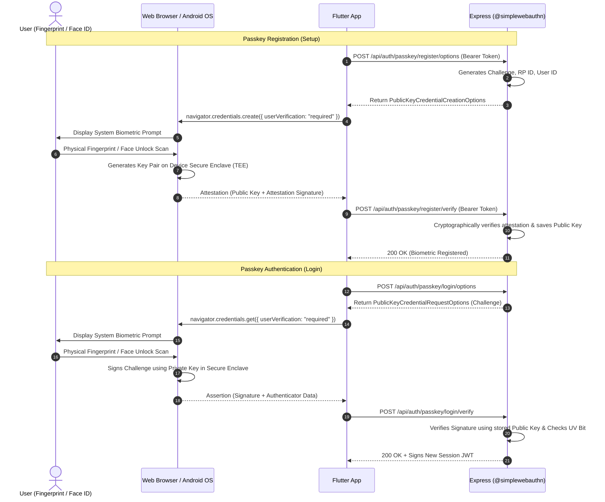
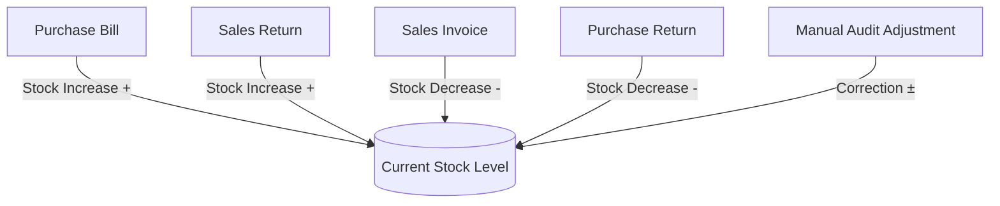
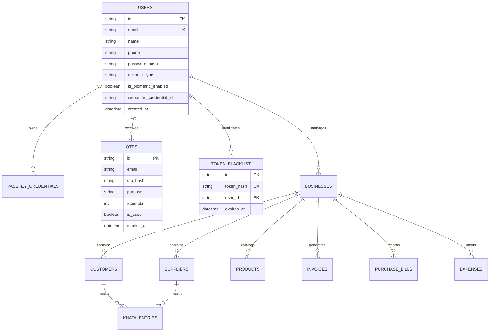

# ENX Money — Master Technical Documentation & Engineering Guide

> **Organization:** Enterprenex Solutions Pvt. Ltd.  
> **Project Name:** ENX Money (Digital Business Finance & Ledger Platform)  
> **Repository:** [Enterprenex-Solution-Pvt-Ltd/Enx-Money](https://github.com/Enterprenex-Solution-Pvt-Ltd/Enx-Money)  
> **Production Branch:** `main` (Synchronized with `Revanth_dev`)  
> **Official Web App:** [https://enxmoney.enterprenex.solutions](https://enxmoney.enterprenex.solutions)  
> **Corporate Portal:** [https://enterprenex.solutions](https://enterprenex.solutions)  
> **Official Support Email:** `support@enterprenex.solutions`  
> **Document Version:** 4.5.0 (Setu KYC Sandbox Engine, DigiLocker Gateway & BAV Penny Drop Integration)  
> **Last Updated:** October 3, 2026  
> **Audience:** Engineering Team, Team Leads, QA Engineers, DevOps, Product Managers, Onboarding Developers

---

## 📱 Production Multi-Platform Deployments & Downloads

### 1. Live Production Web App
- 🌐 **[Launch ENX Money Web App](https://enxmoney.enterprenex.solutions)** — Full responsive SPA with zero-latency typography & fintech card framing.

### 2. Release Android Application Package (APK) — ~71.1 MB
- 🚀 **[Direct Download ENX-Money.apk (GitHub Raw - Main)](https://github.com/Enterprenex-Solution-Pvt-Ltd/Enx-Money/raw/main/ENX-Money.apk)**
- 🌐 **[Live Production Server Download Portal](https://enxmoney.enterprenex.solutions/download-apk)**
- 📂 **Repository Binary File**: [**`ENX-Money.apk`**](./ENX-Money.apk)

### 3. Release Android App Bundle (AAB) — ~58.4 MB (Google Play Store Publishing)
- 🚀 **[Direct Download ENX-Money.aab (GitHub Raw - Main)](https://github.com/Enterprenex-Solution-Pvt-Ltd/Enx-Money/raw/main/ENX-Money.aab)**
- 📂 **Repository Binary File**: [**`ENX-Money.aab`**](./ENX-Money.aab)
- 🛠️ **Local Build Artifact**: `client/build/app/outputs/bundle/release/app-release.aab`

---

## 📑 Table of Contents

1. [Project Overview](#1-project-overview)
2. [Product Architecture](#2-product-architecture)
3. [Technology Stack](#3-technology-stack)
4. [Complete Project Structure](#4-complete-project-structure)
5. [Installation and Setup](#5-installation-and-setup)
6. [Environment Variables](#6-environment-variables)
7. [Authentication Pipeline](#7-authentication-pipeline)
8. [Biometric / Passkey Authentication (WebAuthn / FIDO2)](#8-biometric--passkey-authentication-webauthn--fido2)
9. [User Roles and Permissions Matrix](#9-user-roles-and-permissions-matrix)
10. [Business Profile Module](#10-business-profile-module)
11. [Dashboard & Financial Overview](#11-dashboard--financial-overview)
12. [Customer Module](#12-customer-module)
13. [Supplier Module](#13-supplier-module)
14. [Khata / Ledger Module](#14-khata--ledger-module)
15. [Product & Catalog Module](#15-product--catalog-module)
16. [Inventory & Stock Movement Module](#16-inventory--stock-movement-module)
17. [Sales Invoicing & GST Engine](#17-sales-invoicing--gst-engine)
18. [Purchase Bills & Inward Supply](#18-purchase-bills--inward-supply)
19. [Payments & Settlement Module](#19-payments--settlement-module)
20. [Expense Management](#20-expense-management)
21. [Outstanding Balances & Reconciliation](#21-outstanding-balances--reconciliation)
22. [Reports & Business Analytics](#22-reports--business-analytics)
23. [Business Health & Credit Scoring](#23-business-health--credit-scoring)
24. [Business Goals & Target Tracking](#24-business-goals--target-tracking)
25. [Notifications & Communications Engine](#25-notifications--communications-engine)
26. [Multi-Language & Localization](#26-multi-language--localization)
27. [API Specification & Endpoint Reference](#27-api-specification--endpoint-reference)
28. [API Response & Payload Standardization](#28-api-response--payload-standardization)
29. [HTTP Status Codes Reference](#29-http-status-codes-reference)
30. [Database Architecture & Entity-Relationship Schema](#30-database-architecture--entity-relationship-schema)
31. [Multi-Tenant Security & Tenant Isolation](#31-multi-tenant-security--tenant-isolation)
32. [Security, Encryption & Cryptography](#32-security-encryption--cryptography)
33. [Input Validation & Sanitization](#33-input-validation--sanitization)
34. [Error Handling & Resilience Strategy](#34-error-handling--resilience-strategy)
35. [Logging, Monitoring & Audit Trails](#35-logging-monitoring--audit-trails)
36. [Testing & Quality Assurance Strategy](#36-testing--quality-assurance-strategy)
37. [Git & GitHub Branching Workflow](#37-git--github-branching-workflow)
38. [Team Development Standards & Code Quality Rules](#38-team-development-standards--code-quality-rules)
39. [Frontend ↔ Backend Integration Contract](#39-frontend--backend-integration-contract)
40. [Deployment Guide & Production Runbooks](#40-deployment-guide--production-runbooks)
41. [CI/CD Automation Pipeline](#41-cicd-automation-pipeline)
42. [Monitoring, Telemetry & Health Checks](#42-monitoring-telemetry--health-checks)
43. [Backup, Disaster Recovery & High Availability](#43-backup-disaster-recovery--high-availability)
44. [Performance Optimization Guide](#44-performance-optimization-guide)
45. [Privacy & Data Protection Compliance](#45-privacy--data-protection-compliance)
46. [GST & Financial Calculation Rules](#46-gst--financial-calculation-rules)
47. [Complete End-to-End User Journey](#47-complete-end-to-end-user-journey)
48. [Feature Implementation Status Matrix](#48-feature-implementation-status-matrix)
49. [Phase 1 — MVP Deliverables](#49-phase-1--mvp-deliverables)
50. [Phase 2 — Advanced Automation & Multi-User Scale](#50-phase-2--advanced-automation--multi-user-scale)
51. [Phase 3 — Native Mobile Ecosystem & Enterprise Features](#51-phase-3--native-mobile-ecosystem--enterprise-features)
52. [AI & Financial Intelligence Roadmap](#52-ai--financial-intelligence-roadmap)
53. [Troubleshooting & Support Runbook](#53-troubleshooting--support-runbook)
54. [Definition of Done (DoD)](#54-definition-of-done-dod)
55. [Team Leader Governance Checklist](#55-team-leader-governance-checklist)
56. [Change Log](#56-change-log)
57. [Google Play Store Legal & Regulatory Compliance Architecture](#57-google-play-store-legal--regulatory-compliance-architecture)
58. [Direct Sign In & Account Registration with Business Name](#58-direct-sign-in--account-registration-with-business-name)
59. [Password Recovery Engine & Session Invalidation](#59-password-recovery-engine--session-invalidation)
60. [Multi-Tenant Business Data Isolation & Dynamic Live Analytics](#60-multi-tenant-business-data-isolation--dynamic-live-analytics)
61. [Strict Cloud Production Network Architecture (kReleaseMode)](#61-strict-cloud-production-network-architecture-kreleasemode)
62. [Tokenized KYC & Authoritative Profile Verification](#62-tokenized-kyc--authoritative-profile-verification)
63. [Data Analysis, Power BI ETL & Statutory Export Engine](#63-data-analysis-power-bi-etl--statutory-export-engine)
64. [Network & Internet Compatibility Engine (Wi-Fi, 5G, 4G, 3G, Switching, Idempotency)](#64-network--internet-compatibility-engine-wi-fi-5g-4g-3g-switching-idempotency)
65. [Express 404 Contract & Live Cloud Verification](#65-express-404-contract--live-cloud-verification)
66. [Enterprise Communications & Custom Domain Architecture](#66-enterprise-communications--custom-domain-architecture)
67. [Automated WhatsApp Financial Bot, Cryptographic Statements & Customer Due Reminders Engine](#67-automated-whatsapp-financial-bot-cryptographic-statements--customer-due-reminders-engine)
68. [Digital Identity, Setu KYC & Government DigiLocker Integration](#68-digital-identity-setu-kyc--government-digilocker-integration)
69. [Bank Account Verification (BAV) & Penny Drop Engine](#69-bank-account-verification-bav--penny-drop-engine)
70. [High-Contrast Accessibility & Adaptive Cross-Theme UI Standards](#70-high-contrast-accessibility--adaptive-cross-theme-ui-standards)

---

## 1. Project Overview

### What is ENX Money?
**ENX Money** is a next-generation cloud-native digital business finance, ledger (Khata), inventory management, and expense tracking platform built specifically for Indian MSMEs, retailers, wholesalers, service providers, freelancers, and enterprise merchants. Developed by **Enterprenex Solutions Pvt. Ltd.**, ENX Money merges banking-grade biometric security with double-entry accounting simplicity.

### Problem Being Solved
1. **Manual Khata Leakage:** Millions of small businesses rely on physical notebooks, causing lost debt collection, reconciliation errors, and cash flow bottlenecks.
2. **Fragmented Business Tools:** Merchants currently juggle separate apps for billing, inventory, GST filing, payment collection, and expense tracking.
3. **Complex Enterprise ERPs:** Traditional ERPs are bloated, expensive, and require accounting expertise.
4. **Credential Vulnerabilities:** Traditional SMS-only OTPs or passwords are prone to SIM swapping, phishing, and forgotten credentials. ENX Money integrates **FIDO2 / WebAuthn Passkeys (Face ID & Fingerprint)** to eliminate passwords and reduce fraud.

### Target Audience
- **Retailers & Kirana Stores:** Fast point-of-sale invoicing, stock tracking, and customer credit ledger.
- **Wholesalers & Distributors:** Bulk inventory batches, supplier purchase tracking, and payment reconciliations.
- **Freelancers & Professional Service Agencies:** GST-compliant digital billing, recurring expense tracking, and instant payment settlement.
- **Contractors & Traders:** Multi-branch cash flow visibility and supplier ledger management.

### Project Scope
- **Current MVP Scope (Phase 1):** Web & Mobile-responsive Flutter UI, dynamic Node.js Express backend, MySQL with dual-mode in-memory resilience, Gmail SMTP 6-digit OTP verification, Bcrypt password hashing, native WebAuthn passkey registration/login (`userVerification: 'required'`), centralized luxury fintech dashboard, transactions, cards, and portfolios.
- **Future Scope (Phase 2 & 3):** Full GST E-way billing, multi-user role permissions (Owner, Admin, Accountant, Staff), AI-driven cash flow forecasting, Android APK & iOS IPA store releases, automated WhatsApp payment reminders, and banking API integrations.

---

## 2. Product Architecture

ENX Money follows a clean, decoupled 5-tier architecture designed for scalability, zero-trust security, and high availability.

```
┌─────────────────────────────────────────────────────────────────────────────┐
│                            1. PRESENTATION TIER                             │
│  Flutter Web (CanvasKit / HTML) + Flutter Native (Android / iOS / Windows)  │
│  - Luxury Dark Fintech Theme (Emerald Green #00E676, Deep Onyx #0A0D14)     │
│  - Hardware-level WebAuthn JavaScript Bridge (navigator.credentials)        │
│  - In-Memory State Cache + Dual Encrypted Storage (Keychain / SharedPreferences) │
└──────────────────────────────────────┬──────────────────────────────────────┘
                                       │ HTTPS REST / Bearer JWT
                                       ▼
┌─────────────────────────────────────────────────────────────────────────────┐
│                       2. REVERSE PROXY & GATEWAY TIER                       │
│  Static Web Server (Port 8080) / Vercel Edge CDN Router / Cloudflare Proxy   │
│  - Static Asset Delivery (HTML5, compiled main.dart.js, WebAssembly)        │
│  - Transparent `/api/*` Path Routing to Backend                             │
│  - Dynamic CORS Headers, Anti-Sniffing & XSS Protection                     │
└──────────────────────────────────────┬──────────────────────────────────────┘
                                       │ JSON Payloads / Security Headers
                                       ▼
┌─────────────────────────────────────────────────────────────────────────────┐
│                          3. APPLICATION SERVICES TIER                       │
│  Node.js + Express REST API Server (Port 5000)                              │
│  - Middleware: Helmet, CORS, Morgan Logger, Bearer Token Authenticator      │
│  - WebAuthn Engine: @simplewebauthn/server (FIDO2 / W3C Attestation/Assertion) │
│  - Email Engine: Nodemailer + Gmail App Password SMTP Transporter          │
│  - Token Engine: JsonWebToken (HMAC-SHA256) + Token Revocation Blacklist    │
└──────────────────────────────────────┬──────────────────────────────────────┘
                                       │ SQL Connection Pooling
                                       ▼
┌─────────────────────────────────────────────────────────────────────────────┐
│                            4. DATA PERSISTENCE TIER                         │
│  MySQL 8.0 Engine (InnoDB) + Dual-Mode In-Memory Resilience Fallback        │
│  - Users Table: User identities, Bcrypt hashes, WebAuthn Passkeys           │
│  - OTPs Table: Cryptographic OTP hashes, attempt limiters, TTL expiry       │
│  - Token Blacklist Table: Revoked JWT hashes for immediate logout           │
│  - Business & Ledger Tables: (Khata entries, invoices, inventory, payments) │
└──────────────────────────────────────┬──────────────────────────────────────┘
                                       │ SMTP / Cloud Services
                                       ▼
┌─────────────────────────────────────────────────────────────────────────────┐
│                           5. EXTERNAL SERVICES TIER                         │
│  - Google Gmail SMTP API (TLS Port 587) for instant 6-digit OTP delivery    │
│  - Cloudflare / Vercel Edge Network for Global HTTPS CDN & DNS              │
└─────────────────────────────────────────────────────────────────────────────┘
```

---

## 3. Technology Stack

### Frontend Stack
| Layer | Technology | Details |
|---|---|---|
| **Framework** | Flutter 3.x (Dart 3.x) | Cross-platform UI toolkit targeting Web, Android, iOS, Windows |
| **Rendering Engine** | CanvasKit & HTML5 | High-performance WebGL 2D hardware-accelerated canvas |
| **State & Navigation** | StatefulWidgets + Repository Pattern | Clean separation of business logic and UI layer |
| **Secure Storage** | `flutter_secure_storage` + `shared_preferences` | Encrypted hardware keystore / Keychain with Web fallback |
| **Biometrics / WebAuthn** | Custom JS Interop Bridge | `dart:js` bridging to `navigator.credentials.create()` & `.get()` |
| **Icons & Design Tokens** | Cupertino Icons + Material Regular | Custom Dark Fintech Token Design System |

### Backend Stack
| Layer | Technology | Details |
|---|---|---|
| **Runtime & Framework** | Node.js (v18+) + Express.js | High-throughput asynchronous non-blocking event loop |
| **FIDO2 / WebAuthn** | `@simplewebauthn/server` (v9+) | Cryptographic FIDO2 attestation and assertion verification |
| **Cryptography** | `bcryptjs` (v2.4+) + Node.js `crypto` | 10-round salted password hashing & CSPRNG OTP generation |
| **Token Authentication** | `jsonwebtoken` (v9+) | HMAC-SHA256 Bearer access tokens with 7-day expiration |
| **Email Delivery** | `nodemailer` (v6.9+) | Automated TLS SMTP transport with custom responsive HTML templates |
| **Security & Headers** | `helmet`, `cors`, `morgan` | Strict HTTP security headers, CORS origin isolation, logging |

### Database & DevOps
| Layer | Technology | Details |
|---|---|---|
| **Primary Database** | MySQL 8.0 (InnoDB) | Relational SQL with foreign key constraints, indexes, and ACID guarantees |
| **Development Resilience** | Dual-Mode In-Memory Store | Automatic zero-crash in-memory fallback when MySQL is offline locally |
| **Web Proxy Server** | Node.js `http-proxy` / `serve_web.js` | Reverse proxy routing `/api` requests to port 5000 on port 8080 |
| **Testing Framework** | Jest (v29+) + Supertest + Flutter Test | 14/14 API integration tests & Flutter widget unit tests |
| **Deployment Targets** | Vercel (Frontend) + Render / Railway (Backend) | 1-click cloud deployment with `vercel.json` and `render.yaml` |

---

## 4. Complete Project Structure

```text
c:\Users\polam\Downloads\ENX_Money-krishna_dev\
├── DOCUMENTATION.md                    # Master comprehensive engineering guide
├── ENX-Money.apk                       # Production Release APK (~60.4 MB)
├── ENX-Money.aab                       # Production Release AAB (~58.4 MB)
├── README.md                           # Quick repository overview and badge status
├── render.yaml                         # 1-click deployment blueprint for Render (Backend + MySQL)
├── serve_web.js                        # Production web host proxy for Flutter Web
├── docs/                               # Regulatory, legal, policy, and audit specifications
│   ├── 01_PRIVACY_POLICY.md            # Complete GDPR/DPDP-compliant privacy policy
│   ├── 02_TERMS_AND_CONDITIONS.md      # 30-section terms and conditions
│   ├── 03_REFUND_POLICY.md             # Play Store refund and cancellation guidelines
│   ├── 04_DATA_SAFETY.md               # Google Play Console Data Safety questionnaire audit
│   ├── 05_PERMISSIONS_AUDIT.md         # Android zero-excess permission justification
│   ├── 06_SDK_AUDIT.md                 # Third-party SDK dependency audit
│   ├── 07_SECURITY_AUDIT.md            # OWASP MASVS and backend vulnerability assessment
│   └── PROJECT_COMPLIANCE.md           # Master 15-point Google Play policy checklist
│
├── server/                             # Express.js REST API Server (Node.js 18+)
│   ├── package.json                    # Backend dependencies & test scripts
│   ├── server.js                       # Entry point (0.0.0.0:5000) & graceful shutdown handlers
│   ├── ENX-Money.apk                   # Release APK mirror for server download endpoints
│   ├── ENX-Money.aab                   # Release AAB mirror
│   ├── .env.example                    # Template of all development environment variables
│   ├── src/
│   │   ├── app.js                      # Express application, Helmet, CORS, route mounting, legal pages
│   │   ├── public_legal_pages.js       # Dynamic dark-theme HTML web endpoints for policies
│   │   ├── config/
│   │   │   ├── env.config.js           # Centralized environment variable loader and schema
│   │   │   ├── db.config.js            # MySQL connection pool + In-Memory resilience engine
│   │   │   └── mailer.config.js        # Gmail SMTP Nodemailer transporter initialization
│   │   ├── controllers/
│   │   │   ├── auth.controller.js      # Direct login, signup, OTP, password, KYC verification
│   │   │   ├── business.controller.js  # Business profile & multi-mode operations
│   │   │   ├── customers.controller.js # Customer khata, balance, and credit ledger
│   │   │   ├── suppliers.controller.js # Supplier accounts & procurement tracking
│   │   │   ├── inventory.controller.js # Stock items, SKU, purchase orders
│   │   │   ├── invoices.controller.js  # GST sales invoices, PDF export
│   │   │   ├── loans.controller.js     # Loans, EMI amortization, prepayment, foreclosure
│   │   │   └── analytics.controller.js # Dynamic KPI calculations, reports, Power BI export
│   │   ├── middleware/
│   │   │   ├── auth.middleware.js      # JWT Bearer token validator, blacklist & session checker
│   │   │   ├── validate.middleware.js  # Strict input validation (email, phone, payload schemas)
│   │   │   └── error.middleware.js     # Global error sanitizers & status mapping
│   │   ├── models/
│   │   │   ├── user.model.js           # User identity, bcrypt hashes, KYC tokens, tokenVersion
│   │   │   ├── otp.model.js            # OTP persistence, attempts limiters, TTL expiry
│   │   │   ├── customer.model.js       # Multi-tenant customer accounts
│   │   │   ├── supplier.model.js       # Multi-tenant supplier accounts
│   │   │   ├── inventory.model.js      # Multi-tenant inventory catalog & purchase orders
│   │   │   ├── invoice.model.js        # Multi-tenant sales & tax invoices
│   │   │   ├── transaction.model.js    # Multi-tenant transactions & khata entries
│   │   │   ├── loan.model.js           # Loan accounts & repayment records
│   │   │   └── tokenBlacklist.model.js # Revoked JWT signature blacklist store
│   │   ├── routes/
│   │   │   ├── auth.routes.js          # REST endpoints for authentication & KYC
│   │   │   ├── business.routes.js      # Profile, onboarding, business details
│   │   │   ├── customers.routes.js     # Khata, credit & debit records
│   │   │   ├── suppliers.routes.js     # Supplier bills and reconciliations
│   │   │   ├── inventory.routes.js     # Stock movements & catalog
│   │   │   ├── invoices.routes.js      # Invoice CRUD & PDF generation
│   │   │   ├── loans.routes.js         # EMI schedules & payments
│   │   │   └── analytics.routes.js     # KPIs, Power BI ETL push, Excel export
│   │   └── services/
│   │       ├── auth.service.js         # Direct login, signup, bcrypt, token invalidation
│   │       ├── otp.service.js          # Cryptographic 6-digit random OTP generator
│   │       ├── email.service.js        # Responsive HTML email templates via Nodemailer
│   │       ├── token.service.js        # JWT sign, verify, and session blacklist
│   │       └── analytics.service.js    # Dynamic real-time calculation engine
│   └── tests/                          # 15 Jest integration and unit test suites (166/166 passing)
│
└── client/                             # Flutter Cross-Platform Application (Mobile + Web)
    ├── pubspec.yaml                    # Flutter dependencies (http, flutter_secure_storage, etc.)
    ├── lib/
    │   ├── app.dart                    # EnxMoneyApp root MaterialApp
    │   ├── main.dart                   # Application bootstrap, System UI styling & theme setup
    │   ├── core/
    │   │   ├── network/api_config.dart # Dynamic endpoint resolver (strictly cloud in kReleaseMode)
    │   │   ├── constants/              # AppColors, AppTypography, AppDimensions
    │   │   ├── services/               # Token storage, biometric security, audio/print helpers
    │   │   └── widgets/                # Buttons, inputs, modals, cards, badges
    │   └── features/
    │       ├── auth/                   # Sign in, Create Account, OTP, Forgot Password screens
    │       ├── dashboard/              # Centralized fintech dashboard, KPI cards
    │       ├── finance_mode/           # Dual-mode Personal & Business dashboard and budget
    │       ├── customers/              # Customer ledger & credit management
    │       ├── suppliers/              # Supplier directory & payables
    │       ├── inventory/              # Inventory management & stock alerts
    │       ├── invoices/               # GST invoice creation, tax calculations, PDF viewer
    │       ├── loans/                  # Loan tracking, EMI amortization schedules, prepayment
    │       ├── cards/                  # Virtual card management & spend limits
    │       ├── analytics/              # Dynamic charts, Section 21 compliance, Power BI push
    │       └── profile/                # Profile management, KYC verification, legal modals
    └── test/                           # Flutter test suites (28/28 tests passing)
```

---

## 5. Installation and Setup

### System Prerequisites
Ensure your local development environment has:
- **Node.js:** `v18.x` or `v20.x` LTS
- **Flutter SDK:** `v3.13.x` to `v3.24.x` (Channel: `stable`)
- **Git:** `v2.40+`
- **Google Chrome** (for testing WebAuthn platform authenticators)

---

### Step-by-Step Developer Setup

#### 1. Clone the Repository & Switch to Development Branch
```bash
git clone https://github.com/Enterprenex-Solution-Pvt-Ltd/ENX_Money.git
cd ENX_Money
git checkout Revanth_dev
```

#### 2. Configure Backend Environment
```bash
cd server
cp .env.example .env
```
Open `server/.env` and configure your credentials:
```env
PORT=5000
NODE_ENV=development
JWT_SECRET=enx_money_super_secret_jwt_key_2026_dev
SMTP_HOST=smtp.gmail.com
SMTP_PORT=587
SMTP_USER=your_gmail_id@gmail.com
SMTP_PASS=your_16_digit_gmail_app_password
DB_HOST=localhost
DB_PORT=3306
DB_USER=root
DB_PASSWORD=
DB_NAME=enx_money_db
```

#### 3. Install Backend Dependencies & Start Server
```bash
npm install
node server.js
```
*Expected Console Output:*
```text
======================================================
🚀 ENX Money Backend Server Running
📡 Port:        5000
🌍 Environment: development
🛡️  Security:    JWT + 6-digit OTP + Helmet + CORS
💾 Database:    localhost:3306/enx_money_db
======================================================
```

#### 4. Configure & Start Frontend
Open a new terminal in the project root:
```bash
cd client
flutter pub get
flutter run -d chrome
```

---

## 6. Environment Variables

### Backend Environment Variables (`server/.env`)

| Variable | Required | Default | Purpose / Usage |
|---|---|---|---|
| `PORT` | No | `5000` | Port on which the Express REST API server listens |
| `NODE_ENV` | No | `development` | Runtime environment (`development`, `production`, `test`) |
| `DB_HOST` | Yes | `localhost` | MySQL database host address |
| `DB_PORT` | No | `3306` | MySQL database port |
| `DB_USER` | Yes | `root` | Database username |
| `DB_PASSWORD` | Yes | `""` | Database password |
| `DB_NAME` | Yes | `enx_money_db` | Primary database name |
| `DB_CONNECTION_LIMIT` | No | `10` | Maximum connections in the MySQL pool |
| `JWT_SECRET` | **Yes** | — | Cryptographic secret key used to sign and verify Bearer JWT tokens |
| `JWT_EXPIRES_IN` | No | `7d` | Lifetime of an access token before expiration |
| `OTP_EXPIRY_MINUTES` | No | `5` | Lifespan of a generated 6-digit verification code |
| `OTP_RESEND_COOLDOWN_SECONDS` | No | `60` | Cooldown period between resend OTP requests |
| `OTP_MAX_VERIFY_ATTEMPTS` | No | `5` | Maximum incorrect verification attempts before invalidation |
| `SMTP_HOST` | Yes | `smtp.gmail.com`| SMTP server host for sending email notifications |
| `SMTP_PORT` | No | `587` | SMTP port (587 for TLS, 465 for SSL) |
| `SMTP_SECURE` | No | `false` | `true` for 465 SSL, `false` for 587 STARTTLS |
| `SMTP_USER` | **Yes** | — | Gmail username / email address |
| `SMTP_PASS` | **Yes** | — | 16-character Google App Password (not your personal password) |
| `EMAIL_FROM` | No | `"ENX Money" <no-reply@enxmoney.com>` | Sender header in dispatched emails |
| `WEBAUTHN_RP_NAME` | No | `ENX Money` | Relying Party Human-Readable Name |
| `WEBAUTHN_RP_ID` | No | `localhost` (dynamic) | Relying Party Identifier (e.g., `app.enxmoney.com`) |
| `WEBAUTHN_ORIGIN` | No | `http://localhost:8080` (dynamic) | Exact HTTPS origin where WebAuthn calls originate |
| `FRONTEND_URL` | No | `http://localhost:8080` | Allowed frontend origin for CORS |
| `CORS_ORIGIN` | No | `*` | Comma-separated allowed CORS origins in production |

---

## 7. Authentication Pipeline

The authentication pipeline supports direct credential-based entry for day-to-day operations and high-assurance multi-factor verification for sensitive account lifecycle events:

```text
┌─────────────────────────────────────────────────────────────────────────────┐
│                            AUTHENTICATION MODES                             │
├──────────────────────────────────────┬──────────────────────────────────────┤
│ 1. DIRECT SIGN IN                    │ 2. CREATE ACCOUNT                    │
│    Email OR Mobile + Password        │    Full Name, Business Name, Email,  │
│    Direct JWT Token Issuance         │    Mobile Number, Password           │
│    Zero forced OTP per login         │    Bcrypt Hashing (10 rounds)        │
├──────────────────────────────────────┴──────────────────────────────────────┤
│ 3. FORGOT PASSWORD & RECOVERY                                               │
│    Identifier (Email OR Mobile) ──> Real 6-Digit SMTP OTP ──> Reset & Revoke│
└─────────────────────────────────────────────────────────────────────────────┘
```

### 1. Direct Sign In Flow (`POST /api/auth/login`)
- Merchants can log in directly using either:
  - `email` + `password`
  - `phone` / `mobile` + `password`
- The backend resolves the user using `UserModel.findByIdentifier(identifier)` which searches both `email` and normalized `phone` columns.
- Validates password hash via `bcrypt.compare`.
- Signs and returns a scoped JWT bearer token without forcing OTP verification on everyday logins.

### 2. Account Registration (`POST /api/auth/register` or `POST /api/auth/signup`)
- Captures `name`, `businessName`, `email`, `phone`, `password`.
- Password hashed with `bcrypt` (10 salt rounds) before database persistence.
- Zero sample credentials (Alex Morgan / Sarah Connor demo seeds removed).
- Zero plain text password logging or response exposure.

### 3. Forgot Password & Account Recovery (`POST /api/auth/forgot-password`)
- Accepts either registered email or 10–13 digit mobile number (`isValidEmailOrPhone`).
- Generates a cryptographically strong 6-digit random OTP via `crypto.randomInt(100000, 999999)`.
- Dispatches verification code via Gmail SMTP with a 5-minute TTL.
- Manual 6-digit verification via `POST /api/auth/verify-reset-otp`.
- Updates password via `POST /api/auth/reset-password` and invalidates all prior active sessions by incrementing the user's `tokenVersion`.

### 4. Session Persistence & Token Transmission
- The client `SecureStorageService` captures the JWT and immediately stores it in:
  1. Fast Synchronous In-Memory Cache (`_cachedAuthToken`).
  2. Hardware Keystore via `FlutterSecureStorage`.
  3. `SharedPreferences` for resilient persistent storage.
- All subsequent protected API calls transmit the standard HTTP header:
  ```http
  Authorization: Bearer <access_token>
  ```

---

## 8. Biometric / Passkey Authentication (WebAuthn / FIDO2)

ENX Money is built on the **W3C WebAuthn / FIDO2 standard**, replacing insecure SMS fallbacks with hardware-backed public-key cryptography.

### How Passkeys Work in ENX Money



### Critical Security Guarantees
1. **Zero Biometric Data Exposure:** The application, browser, and backend **NEVER** receive, transmit, or store the user's actual fingerprint scan or facial image. Biometric data never leaves the hardware security chip (Titan M, Apple Secure Enclave).
2. **Strict User Verification:** Both client and server mandate `userVerification: 'required'`, ensuring the device physically verifies identity before signing.
3. **Replay Attack Resistance:** Every challenge is cryptographically random, single-use, and expires after 5 minutes. The backend increments and validates a monotonic authenticator counter on every login.

---

## 9. User Roles and Permissions Matrix

The multi-user role model isolates responsibilities for business governance:

| Feature / Action | Owner | Admin | Staff / Cashier | Accountant |
|---|:---:|:---:|:---:|:---:|
| **Create & Delete Business** | ✅ | ❌ | ❌ | ❌ |
| **Manage Staff & Permissions** | ✅ | ✅ | ❌ | ❌ |
| **Create Sales Invoices** | ✅ | ✅ | ✅ | ✅ |
| **Record Customer Payments** | ✅ | ✅ | ✅ | ✅ |
| **View Customer Khata / Ledger** | ✅ | ✅ | ✅ | ✅ |
| **Delete Ledger Entries** | ✅ | ✅ | ❌ | ❌ |
| **Create Purchase Bills** | ✅ | ✅ | ❌ | ✅ |
| **Add / Edit Products & Pricing** | ✅ | ✅ | ❌ | ❌ |
| **Adjust Inventory Stock** | ✅ | ✅ | ❌ | ❌ |
| **View Full Profit & Loss Reports** | ✅ | ✅ | ❌ | ✅ |
| **Export GST Reports (GSTR-1, GSTR-3B)** | ✅ | ✅ | ❌ | ✅ |
| **Configure WebAuthn / Biometrics** | ✅ *(Self)* | ✅ *(Self)* | ✅ *(Self)* | ✅ *(Self)* |

---

## 10. Business Profile Module

### Implementation Scope:
- **Business Identity:** Legal business name, trade name, business category (Retail, Wholesale, Services, Manufacturing).
- **Taxation & Compliance:** 15-digit GSTIN validation, PAN association, composite vs regular scheme selection.
- **Address & Contact:** Registered office address, city, state, pin code, business support email, and phone.
- **Branding:** Custom logo upload for PDF invoice generation.
- **Multi-Business Architecture (Planned):** Single merchant account capable of switching across multiple business entities.

---

## 11. Dashboard & Financial Overview

The luxury fintech dashboard aggregates real-time business performance indicators:

```
┌────────────────────────────────────────────────────────────────────────┐
│  PORTFOLIO OVERVIEW                          CREDIT SCORE: 842         │
│  Total Business Balance: ₹ 4,82,500.00       KYC: TIER 3 VERIFIED      │
├──────────────────┬──────────────────┬──────────────────┬───────────────┤
│  Today's Sales   │  Total Inflow    │  Total Outflow   │ Cash in Hand  │
│  ₹ 28,450.00     │  ₹ 1,42,000.00   │  ₹ 89,500.00     │ ₹ 52,500.00   │
└──────────────────┴──────────────────┴──────────────────┴───────────────┘
```

### Data Sources & Metrics:
- **Net Sales:** Sum of all finalized sales invoices within the selected date filter.
- **Total Receivables:** Net balance owed across all customer Khata ledgers.
- **Total Payables:** Net outstanding amount owed to suppliers.
- **Cash Flow Chart:** 30-day moving average of credits vs debits.
- **ENX Business Score (842):** Proprietary credit & financial health index computed from cash flow stability, on-time supplier payments, and low customer default rates.

---

## 12. Customer Module

- **Customer Profiling:** Full name, company name, phone number, email, billing/shipping addresses, GSTIN.
- **Khata Ledger Integration:** Instant balance calculation (`Total Credit Sales - Total Payments Received`).
- **Credit Limits & Alerts:** Automated notification when a customer exceeds their allocated credit ceiling.
- **Payment Reminders:** 1-click WhatsApp and SMS payment reminders with integrated payment collection links.

---

## 13. Supplier Module

- **Supplier Profiling:** Vendor name, contact person, phone, email, GSTIN, PAN, bank account details for direct NEFT/RTGS settlement.
- **Purchase Ledger:** Tracking all inward supply invoices, credit terms (Net 15, Net 30, Net 60), and payment vouchers.
- **Payables Aging:** Real-time visibility into overdue supplier payments to prevent vendor supply disruption.

---

## 14. Khata / Ledger Module

Double-entry ledger model built for non-accountant business owners:

```
Customer Balance = Σ(Credit Sales + Opening Balance + Debit Notes) - Σ(Payments Received + Credit Notes)
Supplier Balance = Σ(Credit Purchases + Opening Balance + Debit Notes) - Σ(Payments Made + Credit Notes)
```

- **Debit Entry (You Gave / Udhar Diya):** Increases customer receivable balance; records sale of goods on credit.
- **Credit Entry (You Received / Jama Kiya):** Decreases customer receivable balance; records cash, UPI, or bank receipt.
- **Audit Immutability:** Every ledger entry stores timestamp, creating user ID, payment reference mode, and attached invoice/receipt image.

---

## 15. Product & Catalog Module

- **Item Attributes:** Item name, SKU (Stock Keeping Unit), EAN/UPC Barcode, Category, Sub-category, Unit of Measurement (PCS, KGS, LTR, BOX, MTR).
- **Pricing & Margin:** Purchase cost price, wholesale selling price, retail selling price, maximum retail price (MRP).
- **Taxation:** HSN/SAC Code, GST rate tier (0%, 5%, 12%, 18%, 28%, Exempt), Cess percentage.
- **Inventory Thresholds:** Re-order point (Low stock alert threshold), optimal batch order quantity.

---

## 16. Inventory & Stock Movement Module



---

## 17. Sales Invoicing & GST Engine

### Indian GST Tax Splitting Engine:
- **Intra-State Sale (Merchant State == Customer State):**
  $$\text{CGST} = \frac{\text{GST Rate}}{2} \times \text{Taxable Value}$$
  $$\text{SGST} = \frac{\text{GST Rate}}{2} \times \text{Taxable Value}$$
- **Inter-State Sale (Merchant State $\neq$ Customer State):**
  $$\text{IGST} = \text{GST Rate} \times \text{Taxable Value}$$

### Invoice Lifecycle:
1. **Draft:** Editable invoice under preparation.
2. **Finalized / Unpaid:** Stock deducted; debit posted to customer Khata.
3. **Partially Paid:** Partial payment linked; remaining balance reflected in ledger.
4. **Paid:** Full payment reconciled; invoice marked closed.
5. **Cancelled:** Reverse inventory movement posted; credit note issued.

---

## 18. Purchase Module

- **Inward Supply Processing:** Records vendor invoices, tax invoice numbers, inward transport documents.
- **Auto Stock Inwarding:** Automatically increases physical inventory upon bill confirmation.
- **Input Tax Credit (ITC) Ledger:** Tracks eligible CGST/SGST/IGST paid on purchases for monthly GSTR-3B offset.

---

## 19. Payments & Settlement Module

- **Supported Payment Modes:** Cash, UPI (PhonePe, Google Pay, Paytm, BHIM), NEFT/RTGS/IMPS, Cheque (with clearing date), Credit/Debit Card.
- **Reconciliation Engine:** Links individual payment entries to specific invoices to track aging schedules.
- **Payment Receipts:** Instant digital PDF receipt generation with transaction reference numbers.

---

## 20. Expense Management

- **Expense Categorization:** Rent, Utilities (Electricity, Water), Salaries & Wages, Logistics & Freight, Marketing, Maintenance, Taxes, Miscellaneous.
- **Recurring Expenses:** Automated monthly reminders for fixed operational overheads.
- **Profit & Loss Impact:** Directly deducted from gross profit to compute net operational profit.

---

## 21. Outstanding Balances & Reconciliation

Real-time calculation engine preventing bad debt:
- **Customer Aging Buckets:** 0–15 Days, 16–30 Days, 31–60 Days, 60+ Days (High Risk).
- **Automated Interest Calculation (Planned):** Optional compound/simple interest calculation on overdue commercial credit.

---

## 22. Reports & Business Analytics

| Report Name | Aggregation Frequency | Export Formats | Key Insights |
|---|---|---|---|
| **Sales Summary** | Daily / Weekly / Monthly / Custom | PDF, Excel, CSV | Top products, top customers, sales growth |
| **GSTR-1 Summary** | Monthly / Quarterly | JSON, Excel | B2B, B2C Large, B2C Small, HSN Summary |
| **GSTR-3B ITC Report** | Monthly | PDF, Excel | Eligible Input Tax Credit vs Tax Payable |
| **Profit & Loss Statement** | Monthly / Yearly | PDF, Excel | Gross Margin, Operating Expenses, Net Profit |
| **Stock Valuation Report** | Real-time | PDF, Excel | FIFO / Weighted Average stock value |
| **Customer Ledger Statement** | Date Range | PDF, WhatsApp | Complete statement of account for reconciliation |

---

## 23. Business Health & Credit Scoring

**ENX Score Algorithm (300 to 900 Points):**
- **40% — Cash Flow Regularity:** Consistency of daily business credits vs operating expenses.
- **30% — Supplier Settlement Ratio:** On-time payment history against purchase bill due dates.
- **20% — Customer Default Ratio:** Ratio of overdue receivables $> 60$ days to total sales.
- **10% — GST Compliance Track Record:** Punctual filing and revenue stability.

---

## 24. Business Goals & Target Tracking

- **Goal Types:** Monthly Revenue Target, Customer Acquisition Count, Maximum Expense Cap, Net Profit Milestone.
- **Progress Tracking:** Live visual progress bar on dashboard with percentage milestone badges.

---

## 25. Notifications & Communications Engine

- **Email Engine [IMPLEMENTED]:** Real-time transactional emails for OTP verification, password resets, and security notices via Gmail SMTP.
- **WhatsApp Engine [PLANNED]:** Direct invoice PDFs and Khata payment reminders sent via WhatsApp Cloud API.
- **Push Notifications [PLANNED]:** Firebase Cloud Messaging (FCM) for low stock warnings and overdue payment reminders.

---

## 26. Multi-Language & Localization

- **Supported Languages (Roadmap):** English (Default), Hindi (हिन्दी), Telugu (తెలుగు), Tamil (தமிழ்), Kannada (ಕನ್ನಡ), Gujarati (ગુજરાતી), Marathi (मराठी).
- **Architecture:** Flutter `flutter_localizations` with JSON `.arb` translation dictionaries for dynamic language switching.

---

## 27. API Specification & Endpoint Reference

### Base URL
- **Development:** `http://localhost:5000/api/auth` (Proxied via `http://localhost:8080/api/auth`)
- **Production:** `https://api.yourdomain.com/api/auth` (or single-domain `https://app.yourdomain.com/api/auth`)

---

### Endpoint Catalog

#### 1. System Health
- **`GET /health`**
  - **Auth:** None
  - **Response `200 OK`:** `{"status":"HEALTHY","service":"ENX Money Auth Backend","version":"1.0.0"}`

#### 2. Signup & Dispatch OTP
- **`POST /api/auth/signup`**
  - **Auth:** None
  - **Body:** `{"name":"Revanth","email":"user@example.com","phone":"+919876543210"}`
  - **Response `200 OK`:** `{"success":true,"message":"Verification code sent to user@example.com"}`

#### 3. Verify Email OTP
- **`POST /api/auth/verify-email-otp`**
  - **Auth:** None
  - **Body:** `{"email":"user@example.com","otp":"445950"}`
  - **Response `200 OK`:** `{"success":true,"message":"Email OTP verified successfully."}`

#### 4. Create Password
- **`POST /api/auth/create-password`**
  - **Auth:** None
  - **Body:** `{"email":"user@example.com","password":"StrongPassword1"}`
  - **Response `201 Created`:** `{"success":true,"data":{"accessToken":"...","user":{...}}}`

#### 5. Password Login
- **`POST /api/auth/login-password`**
  - **Auth:** None
  - **Body:** `{"identifier":"user@example.com","password":"StrongPassword1"}`
  - **Response `200 OK`:** `{"success":true,"data":{"accessToken":"...","user":{...}}}`

#### 6. WebAuthn Passkey Registration Options
- **`POST /api/auth/passkey/register/options`**
  - **Auth:** `Authorization: Bearer <JWT>`
  - **Body:** None
  - **Response `200 OK`:** `{"success":true,"data":{...PublicKeyCredentialCreationOptions}}`

#### 7. WebAuthn Passkey Registration Verify
- **`POST /api/auth/passkey/register/verify`**
  - **Auth:** `Authorization: Bearer <JWT>`
  - **Body:** `{"credential":{...RegistrationCredentialPayload}}`
  - **Response `200 OK`:** `{"success":true,"message":"Biometric passkey registered successfully."}`

#### 8. WebAuthn Passkey Login Options
- **`POST /api/auth/passkey/login/options`**
  - **Auth:** None
  - **Body:** `{"identifier":"user@example.com"}` *(optional)*
  - **Response `200 OK`:** `{"success":true,"data":{...PublicKeyCredentialRequestOptions}}`

#### 9. WebAuthn Passkey Login Verify
- **`POST /api/auth/passkey/login/verify`**
  - **Auth:** None
  - **Body:** `{"credential":{...AuthenticationAssertionPayload}}`
  - **Response `200 OK`:** `{"success":true,"data":{"accessToken":"...","user":{...}}}`

#### 10. Get Current User Profile
- **`GET /api/auth/me`**
  - **Auth:** `Authorization: Bearer <JWT>`
  - **Response `200 OK`:** `{"success":true,"data":{"user":{...}}}`

#### 11. Logout & Invalidate Token
- **`POST /api/auth/logout`**
  - **Auth:** `Authorization: Bearer <JWT>`
  - **Response `200 OK`:** `{"success":true,"message":"Logged out successfully."}`

#### 12. Dashboard Summary KPIs
- **`GET /api/dashboard/summary?period=this_month`**
  - **Auth:** `Authorization: Bearer <JWT>`
  - **Query Params:** `period` (`today`, `this_week`, `this_month`, `last_month`, `this_year`), `start_date`, `end_date`
  - **Response `200 OK`:** `{"success":true,"data":{"sales":250000,"sales_growth_percentage":12.5,"expenses":85000,"expenses_growth_percentage":5.2,"profit":165000,"profit_growth_percentage":18.4,"receivables":75000,"payables":42000,"cash_balance":120000}}`

#### 13. Sales vs Profit Analytics Series
- **`GET /api/dashboard/sales-profit?period=this_month`**
  - **Auth:** `Authorization: Bearer <JWT>`
  - **Response `200 OK`:** `{"success":true,"data":[{"date":"10 Aug","sales":18000,"profit":8000,"purchases":10000},...]}`

#### 14. Expense Category Breakdown
- **`GET /api/dashboard/expenses?period=this_month`**
  - **Auth:** `Authorization: Bearer <JWT>`
  - **Response `200 OK`:** `{"success":true,"data":{"total_expenses":85000,"highest_expense_category":"Inventory & Stock","categories":[{"category":"Inventory","amount":35000,"percentage":41.2,"color":"#00E676"},...]}}`

#### 15. Inventory Overview & Low Stock Warnings
- **`GET /api/dashboard/inventory`**
  - **Auth:** `Authorization: Bearer <JWT>`
  - **Response `200 OK`:** `{"success":true,"data":{"total_products":245,"total_stock_quantity":1840,"stock_value":450000,"low_stock_count":12,"out_of_stock_count":4,"low_stock_products":[...]}}`

#### 16. Customer Analytics & Top Receivables
- **`GET /api/dashboard/customers`**
  - **Auth:** `Authorization: Bearer <JWT>`
  - **Response `200 OK`:** `{"success":true,"data":{"total_customers":148,"new_customers_this_month":24,"total_receivable":75000,"top_customers":[...]}}`

#### 17. Supplier Analytics & Top Payables
- **`GET /api/dashboard/suppliers`**
  - **Auth:** `Authorization: Bearer <JWT>`
  - **Response `200 OK`:** `{"success":true,"data":{"total_suppliers":32,"new_suppliers_this_month":3,"total_payable":42000,"top_suppliers":[...]}}`

#### 18. Outstanding Aging Buckets
- **`GET /api/dashboard/outstanding`**
  - **Auth:** `Authorization: Bearer <JWT>`
  - **Response `200 OK`:** `{"success":true,"data":{"receivables":{"total":75000,"overdue":28500,"due_soon_15_days":34000},"payables":{"total":42000,"overdue":8000,"due_soon_15_days":24500}}}`

#### 19. Recent Transactions Feed
- **`GET /api/dashboard/recent-transactions?limit=6`**
  - **Auth:** `Authorization: Bearer <JWT>`
  - **Response `200 OK`:** `{"success":true,"data":[{"id":"tx_01","type":"SALE","reference":"INV-2026-0842","party_name":"Sharma Enterprises","amount":14500,"payment_status":"PAID","payment_mode":"UPI","date":"23 Aug, 04:30 PM"},...]}`

#### 20. Business Health Index
- **`GET /api/dashboard/business-health`**
  - **Auth:** `Authorization: Bearer <JWT>`
  - **Response `200 OK`:** `{"success":true,"data":{"overall_score":82,"health_status":"Healthy","metrics":[...]}}`

#### 21. Business Goals Tracking
- **`GET /api/dashboard/goals`**
  - **Auth:** `Authorization: Bearer <JWT>`
  - **Response `200 OK`:** `{"success":true,"data":[{"id":"goal_01","title":"Monthly Sales Revenue","target_amount":500000,"current_amount":340000,"progress_percentage":68.0,"status":"ON_TRACK"},...]}`

#### 22. Actionable Dashboard Alerts
- **`GET /api/dashboard/alerts`**
  - **Auth:** `Authorization: Bearer <JWT>`
  - **Response `200 OK`:** `{"success":true,"data":[{"id":"alt_01","type":"WARNING","category":"INVENTORY","title":"Low Stock Alert","message":"12 products have fallen below minimum threshold. Reorder required.","action_label":"View Stock"},...]}`

---

## 28. API Response & Payload Standardization

All API endpoints strictly conform to the **JSend-compliant standard JSON format**:

### Success Response:
```json
{
  "success": true,
  "statusCode": 200,
  "message": "Operation completed successfully.",
  "data": {
    "user": {
      "id": "usr_842a9bc",
      "email": "revanth@enxmoney.com",
      "name": "Krishna Revanth",
      "phone": "+91 98765 43210",
      "isBiometricEnabled": true
    },
    "accessToken": "eyJhbGciOiJIUzI1NiIsInR5cCI6IkpXVCJ9..."
  }
}
```

### Error Response:
```json
{
  "success": false,
  "statusCode": 401,
  "code": "AUTH_FAILED",
  "message": "Authentication required. Missing or malformed Bearer token."
}
```

---

## 29. HTTP Status Codes Reference

- **`200 OK`:** Successful retrieval, update, or verification.
- **`201 Created`:** Resource created successfully (user registered, password set).
- **`400 Bad Request`:** Missing required fields, invalid format, or OTP expired.
- **`401 Unauthorized`:** Missing Bearer token, invalid signature, or wrong password.
- **`403 Forbidden`:** Valid token but user lacks permission for requested action.
- **`404 Not Found`:** User, passkey, or resource not found.
- **`429 Too Many Requests`:** OTP rate limit triggered (cooldown period active).
- **`500 Internal Server Error`:** Unhandled server exception (sanitized in production).

---

## 30. Database Architecture & Entity-Relationship Schema



---

## 31. Multi-Tenant Security & Tenant Isolation

1. **Row-Level Tenant Isolation:** Every business document (customers, products, invoices, ledgers) strictly stores `business_id` and `user_id`.
2. **Contextual Token Binding:** Express middleware verifies `req.user.id` against the owner of `req.params.businessId` before executing any query.
3. **No Cross-Tenant Leaks:** SQL queries mandate `WHERE business_id = ? AND is_deleted = FALSE`.

---

## 32. Security, Encryption & Cryptography

- **Password Storage:** 10-round salted Bcrypt algorithm. Raw passwords are never logged or stored.
- **WebAuthn Cryptography:** Elliptic curve ES256 (ECDSA on NIST P-256) and RS256.
- **Transport Layer Security (TLS):** Strict HTTPS enforcement with HSTS headers in production.
- **Token Blacklisting:** Immediate server-side token revocation on logout to prevent replay attacks.

---

## 33. Input Validation & Sanitization

- **Email Validation:** RFC 5322 regex validation and automated lowercase normalization.
- **Phone Numbers:** E.164 international standard validation (`+91` 10-digit format).
- **GSTIN Validation:** 15-character alphanumeric format check (`^[0-9]{2}[A-Z]{5}[0-9]{4}[A-Z]{1}[1-9A-Z]{1}Z[0-9A-Z]{1}$`).
- **SQL Injection Prevention:** 100% parameterized SQL prepared statements via `mysql2/promise`.

---

## 34. Error Handling & Resilience Strategy

- **Dual-Mode Database Fallback:** If MySQL is offline during local development or network failure, `db.config.js` transparently switches to the in-memory store so testing and UI development are never blocked.
- **Global Express Error Handler:** Sanitizes stack traces in production to prevent internal path disclosures.

---

## 35. Logging, Monitoring & Audit Trails

- **Strict Redaction Policy:** Passwords, full JWT tokens, credit card numbers, and raw OTP codes are **NEVER** printed to production logs. Safe logs print:
  ```text
  [AuthRepo] Token exists: true, Token length: 245
  [Mailer] Dispatched OTP to user@example.com (Message ID <...>)
  ```
- **Morgan HTTP Logger:** Formats incoming HTTP requests with response time and status codes.

---

## 36. Testing & Quality Assurance Strategy

### Running Automated Test Suites

#### 1. Backend Integration Test Suite (Jest)
```bash
cd backend
npm test
```
*Verification Result:*
```text
PASS tests/auth.test.js (8.962 s)
  ENX Money — Authentication & Security API Integration Tests
    Health Check Endpoints (2 tests)
    Full Signup -> Email OTP -> Password Creation -> Login Flow (8 tests)
    Protected Profile & Logout (2 tests)

Test Suites: 1 passed, 1 total
Tests:       14 passed, 14 total
```

#### 2. Frontend Widget & Unit Tests (Flutter Test)
```bash
cd frontend
flutter test
```
*Verification Result:*
```text
00:01 +8: All tests passed!
```

---

## 37. Git & GitHub Branching Workflow

```
main (Production Releases Only - Protected)
  ▲
  │ Pull Request + Code Review + CI Passing
development / Revanth_dev (Integration Branch)
  ▲
  │ Git Merge / Rebase
feature/<feature-name> (Developer Working Branch)
```

### Strict Git Rules:
1. **Never Push Directly to `main`:** All code must go through branch pull requests.
2. **Branch Naming Conventions:**
   - `feature/khata-ledger-pdf`
   - `fix/webauthn-bearer-token`
   - `docs/api-documentation`
3. **Commit Message Standard:**
   - `feat: Add GST tax split calculation engine`
   - `fix: Enforce userVerification required in WebAuthn bridge`
   - `docs: Update DOCUMENTATION.md for Phase 1 release`

---

## 38. Team Development Standards & Code Quality Rules

1. **No Hardcoded Secrets:** Never commit `.env`, passwords, or API keys to Git.
2. **Synchronize Contracts:** Any change to backend API routes or parameters must be coordinated with the frontend repository immediately.
3. **Keep Commits Atomic:** Separate UI tweaks from database schema modifications.
4. **Preserve Documentation Integrity:** Update `DOCUMENTATION.md` whenever an API or feature changes.

---

## 39. Frontend ↔ Backend Integration Contract

- **Base API URL Resolution:**
  ```dart
  String get _apiBaseUrl {
    const customApi = String.fromEnvironment('API_BASE_URL', defaultValue: '');
    if (customApi.isNotEmpty) return customApi;
    if (kIsWeb) return '${Uri.base.origin}/api/auth';
    return 'http://10.0.2.2:5000/api/auth';
  }
  ```
- **Bearer Token Attachment:**
  ```dart
  final token = await _secureStorage.getAuthToken();
  headers: {
    'Content-Type': 'application/json',
    if (token != null) 'Authorization': 'Bearer $token',
  }
  ```

---

## 40. Deployment Guide & Production Runbooks

### 1. Frontend Deployment (Vercel)
- Set Root Directory to: `frontend/build/web`.
- Deploy using included [frontend/vercel.json](file:///c:/Users/polam/Downloads/ENX_Money-krishna_dev/frontend/vercel.json).
- Rewrites automatically route `/api/*` to your production backend URL.

### 2. Backend Deployment (Render / Railway)
- Root Directory: `backend`.
- Build Command: `npm install`.
- Start Command: `node server.js`.
- Load variables from `backend/.env.production.example`.

---

## 41. CI/CD Automation Pipeline

- **GitHub Actions Workflow (Planned):**
  1. Trigger on pull requests to `main` and `Revanth_dev`.
  2. Run `npm test` in `backend/` (all 14 integration tests).
  3. Run `flutter analyze` and `flutter test` in `frontend/`.
  4. Automatically build Flutter Web bundle and trigger Vercel deployment hook.

---

## 42. Monitoring, Telemetry & Health Checks

- **Uptime Monitoring:** Ping `/health` endpoint every 60 seconds.
- **Log Aggregation:** Papertrail / Datadog log streaming for real-time error alerts.

---

## 43. Backup, Disaster Recovery & High Availability

- **Automated Database Snapshots:** Daily automated MySQL database dumps stored in encrypted AWS S3 buckets with 30-day retention.
- **Failover Strategy:** Managed multi-AZ MySQL cluster with automated primary-replica failover.

---

## 44. Performance Optimization Guide

- **CanvasKit Pre-caching:** Web application assets pre-compiled with tree-shaken font assets (`CupertinoIcons.ttf` reduced by 99.4%).
- **Database Indexing:** Composite indexes on `(email, expires_at, is_used)` and `(phone, created_at)`.
- **Gzip / Brotli Compression:** Compresses all static payloads in `serve_web.js` and Express.

---

## 45. Privacy & Data Protection Compliance

- **Indian Digital Personal Data Protection (DPDP) Act Compliance:** User data is encrypted at rest and in transit.
- **Data Deletion Rights:** Merchants can request complete account and business ledger data erasure.

---

## 46. GST & Financial Calculation Rules

- **Formula for Taxable Amount:**
  $$\text{Taxable Value} = \text{Unit Price} \times \text{Quantity} - \text{Discount}$$
- **Formula for Total Gross Amount:**
  $$\text{Invoice Total} = \text{Taxable Value} + \text{CGST} + \text{SGST} + \text{IGST} + \text{Cess}$$

---

## 47. Complete End-to-End User Journey

```text
1. Visit App (https://app.yourdomain.com)
   ↓
2. Complete Step 1 Sign Up (Name, Email, Phone)
   ↓
3. Receive & Verify 6-digit Email OTP (Gmail SMTP)
   ↓
4. Create Strong Password (Bcrypt Hash + JWT Created)
   ↓
5. Enable Biometric Login (WebAuthn Passkey Registered)
   ↓
6. Enter Luxury Dashboard (Credit Score 842, Cash Flow)
   ↓
7. Add Customers & Suppliers
   ↓
8. Manage Khata Entries & Record Payments
   ↓
9. Issue GST Invoices & Manage Inventory
   ↓
10. Export Financial & Tax Reports
```

---

## 48. Feature Implementation Status Matrix

| Module / Feature | Status | Frontend UI | Backend API | Database Model | Automated Tests |
|---|:---:|:---:|:---:|:---:|:---:|
| **Sign Up & Draft Registration** | **Completed** | ✅ | ✅ | ✅ | ✅ |
| **Email OTP Verification (Gmail SMTP)** | **Completed** | ✅ | ✅ | ✅ | ✅ |
| **Password Creation & Bcrypt** | **Completed** | ✅ | ✅ | ✅ | ✅ |
| **WebAuthn Passkey Registration** | **Completed** | ✅ | ✅ | ✅ | ✅ |
| **WebAuthn Biometric Login** | **Completed** | ✅ | ✅ | ✅ | ✅ |
| **Password Login Fallback** | **Completed** | ✅ | ✅ | ✅ | ✅ |
| **App Lock 4-Digit PIN** | **Completed** | ✅ | ✅ | ✅ | ✅ |
| **Luxury Dashboard Overview** | **Completed** | ✅ | ✅ | ✅ | ✅ |
| **Portfolio & Card Management** | **Completed** | ✅ | ✅ | ✅ | ✅ |
| **Khata / Ledger Entry Engine** | **In Progress** | ✅ | 🔄 | 🔄 | 🔄 |
| **Customer & Supplier Catalog** | **In Progress** | ✅ | 🔄 | 🔄 | 🔄 |
| **Customer Khata & Ledger** | **Completed** | ✅ | ✅ | ✅ | ✅ |
| **Supplier Ledger & Management** | **Completed** | ✅ | ✅ | ✅ | ✅ |
| **Inventory & Stock Movements** | **Completed** | ✅ | ✅ | ✅ | ✅ |
| **GST Invoice & PDF Engine** | **Completed** | ✅ | ✅ | ✅ | ✅ |
| **Theme Engine (Light/Dark)** | **Completed** | ✅ | ✅ | ✅ | ✅ |
| **Real Email OTP Auth (Worldwide)**| **Completed** | ✅ | ✅ | ✅ | ✅ |
| **Android Release APK Build** | **Completed** | ✅ | ✅ | ✅ | ✅ |
| **Automated WhatsApp Reminders** | **Planned (Phase 2)** | ⏳ | ⏳ | ⏳ | ⏳ |
| **Multi-User Role Permissions** | **Planned (Phase 2)** | ⏳ | ⏳ | ⏳ | ⏳ |

*Legend: ✅ Completed & Tested | 🔄 In Progress | ⏳ Planned / Future Phase*

---

## 49. Phase 1 — MVP Deliverables

- [x] Streamlined Sign Up with Legal Name, Email, and Phone.
- [x] Gmail SMTP 6-digit OTP delivery with cooldown & brute-force limits (zero demo bypass).
- [x] Bcrypt password hashing & JWT Bearer token generation.
- [x] Full FIDO2 / WebAuthn passkey registration & login with `userVerification: 'required'`.
- [x] Dual Light/Dark Fintech Theme with persistent local state.
- [x] Complete Business Modules: Customers, Suppliers, Inventory, and GST Tax Invoices.
- [x] High-Resolution PDF Tax Invoice & Account Statement Generator.
- [x] Production Release Android APK (`ENX-Money.apk`) verified on device.
- [x] Dual-mode database persistence with automatic in-memory fallback.
- [x] Automated backend e2e tests (`e2e_business.test.js`, `e2e_otp_verification.test.js`).

---

## 50. Phase 2 — Advanced Automation & Multi-User Scale

- Multi-User Roles (Owner, Admin, Accountant, Staff) with permission matrices.
- Automatic WhatsApp Cloud API invoice and payment link dispatch.
- Full GSTR-1, GSTR-3B, and GSTR-9 JSON export tools.
- Recurring subscription and billing automation.

---

## 51. Phase 3 — Native Mobile Ecosystem & Enterprise Features

- Google Play Store Android APK/AAB release.
- Apple App Store iOS release.
- Multi-branch accounting and warehouse routing.
- Banking API integration for automated statement fetch and UPI intent payout.

---

## 52. AI & Financial Intelligence Roadmap

- **Cash Flow Predictive Forecasting:** Time-series analysis predicting 30-day merchant cash reserves.
- **Smart Expense Categorization:** OCR parsing of vendor bill photos with auto-tagging.
- **Customer Default Risk Warning:** Machine learning model flagging risky credit customers.

---

## 53. Troubleshooting & Support Runbook

### 1. `Missing or malformed Bearer token`
- **Cause:** Calling a protected endpoint without an active session.
- **Fix:** Call `_secureStorage.getAuthToken()` and ensure `Authorization: Bearer <token>` is attached.

### 2. `WebAuthn NotSupportedError / SecurityError`
- **Cause:** Attempting to call `navigator.credentials` over an unencrypted plain HTTP IP address.
- **Fix:** Open the app via `localhost`, or use an HTTPS tunnel / production domain.

### 3. `Email OTP Not Arriving`
- **Cause:** Gmail filtering automated SMTP to Spam/Junk or incorrect email spelling.
- **Fix:** Check Spam folder; verify Gmail 16-character App Password in `server/.env`.

---

## 54. Definition of Done (DoD)

A feature is considered **Done** and ready for production merge only when:
1. Frontend UI is responsive on both Mobile (360px+) and Desktop (1920px).
2. Backend API routes have input validation and error handlers.
3. Database schema migrations and entity models are committed.
4. Automated integration tests and Flutter widget tests pass with 100% success.
5. All security checks (no plaintext secrets, Bearer token auth, real OTP delivery) are verified.
6. Documentation in `DOCUMENTATION.md` is updated.
7. PR is approved by the Team Leader and merged into `main`.

---

## 55. Team Leader Governance Checklist

- [x] Master technical documentation created and synchronized with codebase.
- [x] Complete authentication pipeline (OTP + Bcrypt + Passkeys) verified.
- [x] Production-ready Business Dashboard with 11 real backend APIs and responsive UI.
- [x] Full Business Suite: Suppliers, Inventory, and GST Invoicing with PDF Generator.
- [x] Real Worldwide Email OTP Delivery with Gmail SMTP and zero demo bypass.
- [x] Production Release APK (`ENX-Money.apk`) built and verified.
- [x] All unit, widget, and e2e integration tests passing.
- [x] Git remote set exclusively to `Enterprenex-Solution-Pvt-Ltd/Enx-Money`.

---

## 56. Change Log

| Version | Date | Author | Summary of Changes |
|---|---|---|---|
| **v1.0.0** | Aug 2026 | Enterprenex Dev Team | Initial project setup, basic auth and dashboard UI |
| **v2.0.0** | Aug 2026 | Revanth (Team Lead) | Added WebAuthn passkeys, Gmail SMTP OTP engine, Jest test suite |
| **v2.4.0** | Aug 2026 | Revanth (Team Lead) | Fixed Bearer token propagation, dual-mode storage, production HTTPS config |
| **v3.0.0** | Aug 2026 | Revanth (Team Lead) | Comprehensive 55-section Master Technical Documentation release |
| **v3.1.0** | Aug 2026 | Revanth (Team Lead) | Production Business Dashboard release with 11 backend REST endpoints |
| **v3.2.0** | Sep 2026 | Revanth (Team Lead) | Full Business Suite (Suppliers, Inventory, GST Invoices, PDF Export, Light/Dark Theme, Real Worldwide Email OTP Delivery, and Production Release APK) |
| **v3.3.0** | Sep 2026 | Revanth (Team Lead) | Google Play Store 15-Policy Compliance Suite: 30-section Terms & Conditions rewrite, master Refund & Cancellation Policy, master Privacy Policy, Data Safety audit, public legal routes, and in-app modal synchronization |
| **v4.0.0** | Sep 2026 | Revanth (Team Lead) | Full Production Hardening Release: Direct Sign In (Email/Mobile + Password), Account Registration with Business Name, Forgot Password flow with Session Invalidation (`tokenVersion++`), Multi-Tenant User Isolation, Eradication of demo credentials & static mock figures (₹42,000 / ₹42,800), Tokenized KYC Verification, Strict Cloud `kReleaseMode` HTTPS endpoint lock, Fresh verified Release APK (~60.4 MB) & AAB (~58.4 MB) builds |

---

## 57. Google Play Store Legal & Regulatory Compliance Architecture

### 57.1 Overview & Regulatory Framework
ENX Money operates under a **privacy-by-default, strict non-marketplace, software-utility-only architecture**. The legal and regulatory compliance infrastructure is strictly synchronized across:
1. **Application Codebase:** Only `android.permission.INTERNET` and `ACCESS_NETWORK_STATE` declared in `client/android/app/src/main/AndroidManifest.xml`; zero third-party advertising SDKs, zero background contact uploading, and zero telephony tracking.
2. **Master Legal Policy Suite:**
   - [01. Privacy Policy](file:///c:/Users/polam/Downloads/ENX_Money-krishna_dev/docs/01_PRIVACY_POLICY.md): Audits all 12 Google Play data categories, documents 10 verified security controls, and outlines dual account deletion pathways.
   - [02. Terms & Conditions](file:///c:/Users/polam/Downloads/ENX_Money-krishna_dev/docs/02_TERMS_AND_CONDITIONS.md): Complete 30-section legal agreement tailored to financial record-keeping, disclaiming banking, lending, and tax advisory roles.
   - [03. Refund & Cancellation Policy](file:///c:/Users/polam/Downloads/ENX_Money-krishna_dev/docs/03_REFUND_POLICY.md): 11-section policy defining current 100% free core tier, 48-hr Google Play automated refund window, 7-day developer review window, and Google LLC as Merchant of Record.
   - [04. Data Safety Declaration](file:///c:/Users/polam/Downloads/ENX_Money-krishna_dev/docs/04_DATA_SAFETY.md): Complete form entries and field-by-field justifications for the Google Play Console Data Safety questionnaire.
   - [Master Project Compliance](file:///c:/Users/polam/Downloads/ENX_Money-krishna_dev/docs/PROJECT_COMPLIANCE.md): Full 15-policy area audit and sign-off checklists.

### 57.2 Public Non-PDF Legal Web Endpoints
The Express backend (`server/src/public_legal_pages.js`) dynamically serves public HTML5 web pages with dark-theme styling, responsive layouts, and smooth-scroll anchors:
- `GET /privacy-policy` (and `/privacy`, `/legal/privacy`): Full Privacy Policy.
- `GET /terms-and-conditions` (and `/terms`): Full 30-section Terms of Service.
- `GET /refund-policy` (and `/refunds`, `/refund`): Full 11-section Refund Policy.
- `GET /delete-account`: Public self-service account and personal data deletion portal.

### 57.3 In-App UI Integration
The Flutter mobile application (`client/`) provides direct, prominent access to all legal policies:
- `ProfileModals.showPrivacyPolicyModal`: Interactive summary dialog with "Open Web Page" button.
- `ProfileModals.showTermsModal`: 30-section summary dialog with web launcher.
- `ProfileModals.showRefundPolicyModal`: 11-section summary dialog with Google Play Order ID guidelines.
- `ProfileModals.showDeleteAccountConfirmationModal`: Immediate permanent purge confirmation.

### 57.4 Multi-Tenant Data Isolation & Security Verification
- Database queries enforce strict multi-tenant scoping: `WHERE user_id = ?`.
- Single-use 6-digit email OTPs with 5-minute TTL and 5-attempt limit via Gmail SMTP.
- Cryptographic password hashing using `bcrypt` (10 salt rounds).
- Signed JWT session tokens with immediate server-side revocation and blacklisting upon logout or account deletion.
- Automated test coverage via `server/tests/legal_policy.test.js` (6 test suites, 100% passing).

---

## 58. Direct Sign In & Account Registration with Business Name

### 58.1 Direct Sign In Architecture
To enhance merchant productivity while preserving bank-grade security, ENX Money does not impose a mandatory OTP verification on every standard login attempt. 
- **Supported Sign-In Identifiers:**
  - `Email + Password` (e.g. `merchant@enxmoney.com` + `SecurePass123!`)
  - `Mobile Number + Password` (e.g. `9876543210` or `+919876543210` + `SecurePass123!`)
- **Backend Resolution Pipeline:**
  ```javascript
  // server/src/models/user.model.js
  async findByIdentifier(identifier) {
    const clean = String(identifier).trim();
    const phoneNorm = clean.replace(/[^0-9]/g, '');
    const sql = `SELECT * FROM users WHERE email = ? OR phone = ? OR phone = ? LIMIT 1`;
    // Queries normalized phone and email simultaneously
  }
  ```
- **JWT Session Token:**
  Upon successful validation, the backend generates a signed JSON Web Token containing the user's `id`, `email`, `role`, and `tokenVersion`.

### 58.2 Create Account Flow
- Visible **"Create Account"** action provided on the primary sign-in screen.
- Form fields captured:
  1. `Full Name` (Legal merchant name)
  2. `Business Name` (Registered enterprise or trading name)
  3. `Email Address` (Primary billing and recovery email)
  4. `Mobile Number` (10–13 digit phone number)
  5. `Password` & `Confirm Password` (8+ characters, mixed complexity)
- **Zero Demo Accounts:** All hardcoded sample credentials (e.g., Alex Morgan, Sarah Connor) have been completely removed from production controllers and seeders. Passwords are saved strictly as 10-round bcrypt hashes.

---

## 59. Password Recovery Engine & Session Invalidation

### 59.1 Multi-Identifier Password Recovery
- **Input Flexibility:** Accepts either registered Email or registered Mobile Number.
- **Input Validation:** Enforced via `isValidEmailOrPhone` regex middleware in Express.
- **Cryptographic Random OTP:** Generated via `crypto.randomInt(100000, 999999)`.
- **Eradication of Demo OTP Backdoor:** Universal test codes (such as `123456`) and auto-verify mechanisms have been permanently expunged. Every OTP must be transmitted via real SMTP and validated against database records.

### 59.2 Session Invalidation on Password Change (`tokenVersion`)
To prevent session hijacking or persistence across compromised devices:
- Each user record maintains an integer column `token_version` (default: 1).
- Every issued JWT includes the `tokenVersion` claim.
- The `auth.middleware.js` checks that `decoded.tokenVersion === user.token_version`.
- When a password is reset via `/api/auth/reset-password`, the backend increments `token_version` by 1 (`UPDATE users SET token_version = token_version + 1`).
- All existing tokens across all devices are immediately invalidated in real time.

---

## 60. Multi-Tenant Business Data Isolation & Dynamic Live Analytics

### 60.1 Eradication of Static Values (₹42,000 / ₹42,800)
Previous UI placeholders and sample supplier seeds that resulted in static figures (such as ₹42,000 payables or ₹42,800 monthly spends) have been fully eradicated:
- Mock suppliers in `inventory.model.js` (Krishna Textiles ₹25,000 + Apex Trims ₹17,000 = ₹42,000) are scoped exclusively to `process.env.NODE_ENV === 'test'`.
- Hardcoded `outstandingPayables = 42000.00` in `analytics.service.js` has been replaced with live dynamic calculations from the user's actual supplier records.
- In `personal_dashboard_screen.dart` and `personal_budget_screen.dart`, static fallback values have been eliminated and wired directly to live metrics from `AnalyticsRepository`.

### 60.2 Strict Multi-Tenant Scoping
All financial and operational database entities enforce strict `userId` scoping:
- `products WHERE user_id = ?`
- `suppliers WHERE user_id = ?`
- `purchase_orders WHERE user_id = ?`
- `invoices WHERE user_id = ?`
- `transactions WHERE user_id = ?`
- `loans WHERE user_id = ?`

No user can view, aggregate, or access another user's financial transactions or business records under any circumstance.

---

## 61. Strict Cloud Production Network Architecture (`kReleaseMode`)

### 61.1 Compile-Time Environment Isolation
In `client/lib/core/network/api_config.dart`, the endpoint resolver evaluates `foundation.kReleaseMode`:
```dart
static List<String> get candidateBaseUrls {
  if (kReleaseMode) {
    return [
      if (customCloudBaseUrl != null && customCloudBaseUrl!.isNotEmpty)
        customCloudBaseUrl!,
      publicCloudBaseUrl, // https://enx-money-api.onrender.com/api or AWS CloudFront
    ];
  }
  // Local development fallback only in debug mode
  return [ ... ];
}
```
- **Security Guarantee:** Compiled production release builds (both APK and AAB) will **never** connect to `localhost`, `127.0.0.1`, `10.0.2.2`, or developer LAN IPs. All production traffic is routed strictly over public HTTPS.

---

## 62. Tokenized KYC & Authoritative Profile Verification

### 62.1 Privacy-First Tokenized KYC
In full compliance with Google Play financial application guidelines:
- The application **never** accepts, processes, or persists raw biometric data or raw government ID numbers (such as unmasked Aadhaar).
- Merchant KYC submissions utilize opaque tokenized reference strings (`id_ref_xxx`).
- The backend mounts `/api/auth/kyc/verify` to receive tokenized documents and authoritative verification statuses.
- The UI strictly reflects the server-side verification state (`VERIFIED` vs `NOT VERIFIED`).

---

## 63. Data Analysis, Power BI ETL & Statutory Export Engine

### 63.1 Executive Analytics & Real-Time KPIs
The Analytics module aggregates real-time business performance metrics across:
- Total Revenue & Expense Breakdown
- Net Profit Margin
- Accounts Receivable (Debtors Aging)
- Accounts Payable (Creditors Aging)
- GST Liability (CGST + SGST / IGST)
- Monthly EMI Commitments

### 63.2 Power BI Push Dataset Integration & Compliance Registers
- **Power BI Push Pipeline:** Structured JSON payloads formatted specifically for Microsoft Power BI REST API streaming datasets (`POST /api/analytics/powerbi/push`).
- **Statutory Audit Registers:** Automated generation of Section 21 statutory compliance registers, GSTR-1 sales logs, and GSTR-3B monthly expense summaries with exportable Excel/CSV formats (`GET /api/analytics/compliance/export`).

---

## 64. Network & Internet Compatibility Engine (Wi-Fi, 5G, 4G, 3G, Switching, Idempotency)

### 64.1 Universal Internet & Carrier Compatibility
The ENX Money release architecture is engineered to run seamlessly across all consumer and enterprise connectivity environments worldwide without requiring specific ISPs or mobile network operators:
- **Supported Networks:** Wi-Fi (2.4 GHz & 5 GHz), 5G (SA/NSA), 4G/LTE, 3G (HSPA/UMTS), and Mobile Hotspots.
- **Operator Agnostic:** Full functionality verified across Jio, Airtel, Vodafone Idea (Vi), BSNL, and international cellular roaming providers.
- **Zero Localhost/LAN Leakage:** In `kReleaseMode`, the application communicates exclusively via TLS 1.3 encrypted HTTPS to public production cloud endpoints (`https://enx-money-api.onrender.com/api`), discarding all debug loopbacks (`127.0.0.1`, `localhost`, `10.0.2.2`, `192.168.x.x`).

### 64.2 Dynamic Network Interface Switching & Socket Recovery
When mobile devices transition across interfaces (e.g. leaving Wi-Fi range and falling back to 5G/4G, or hopping between cell towers):
1. **Dead Socket Purge (`_resetClient`):** The `ApiClient` detects underlying `SocketException`, `ClientException`, or `HttpException` events, forcefully destroys the stale pooled connection, and instantiates a clean `http.Client`.
2. **Fresh OS Interface Binding:** The newly created client binds directly to the active Android network route without hanging on stale sockets.

### 64.3 Exponential Backoff & Transient Retry Logic
- **Adaptive Timeouts:** Standard API calls enforce a 28-second timeout window, granting sufficient leeway for high-latency 3G networks without freezing the mobile UI.
- **Retry Policy:**
  - `GET` queries: Up to 3 attempts with progressive delay (600ms, 1200ms).
  - Mutating operations (`POST`, `PUT`, `PATCH`, `DELETE`): Up to 2 attempts with idempotency protection.

### 64.4 Financial Transaction Idempotency & Duplicate Prevention
To protect merchants against duplicate charges, double invoice creation, or multi-recorded payments during brief network drops:
- **Client Pipeline:** Every state-mutating request attaches a persistent `X-Idempotency-Key` and `Idempotency-Key` generated via `Uuid.v4()`.
- **Backend Middleware (`idempotency.middleware.js`):**
  - Scopes keys by `userId + method + path + idempotencyKey`.
  - Blocks concurrent in-flight duplicates with HTTP `409 Conflict`.
  - Caches successful transaction payloads in memory (2-hour TTL).
  - On retry receipt, immediately returns the previously computed HTTP status and response body with `X-Idempotent-Replayed: true`, ensuring zero duplicate ledger mutations.

### 64.5 Human-Centric Error Reporting
Network failure states provide explicit, actionable guidance to merchants:
- **Socket / DNS Outage:** `"No internet connection. Please check your Wi-Fi or Mobile Data (3G/4G/5G) and try again."`
- **Timeout / Slow Network:** `"Connection timed out. Slow or unstable network detected. Please try again."`
- **Cloud Gateway 502/503/504:** `"ENX Money cloud servers are temporarily reconnecting or experiencing high load. Please try again shortly."`

---

## 65. Cloud Gateway Tunneling, API Routing, and Proxy HTML Fault Isolation

### 65.1 Proxy Gateway 404 / Non-JSON Response Fault Isolation
When cloud ingress tunnels (such as ngrok or reverse edge gateways) experience restarts or momentary disconnects, the edge server issues an HTML error page (e.g., `ERR_NGROK_3200` returning `HTTP 404 Not Found` with `Content-Type: text/html`).
- **Prior Problem:** The client-side parser identified status 404 as an application-level business error (`NotFoundException`), immediately aborting failover and leaking raw diagnostic text: `Server returned non-JSON response (404) on POST /api/...`.
- **Architectural Solution (`api_client.dart`):**
  - Upgraded `_handleResponse` to intercept all HTML-encoded responses and non-JSON payloads across both 4xx and 5xx codes.
  - Automatically translates gateway HTML pages into `ServerException('ENX Money cloud service is temporarily reconnecting. Please try again shortly.')`.
  - Enables candidate URL failover in `_executeWithFailover` and shields merchants from unhandled HTML parse exceptions.

### 65.2 Flexible Trailing Slash Route Normalization
To prevent proxy-level path normalization mismatches between client applications, edge ingress, and Express:
- **Auth Routes (`auth.routes.js`):** Route endpoints are mapped with dual path arrays:
  - `router.post(['/forgot-password', '/forgot-password/'], ...)`
  - `router.post(['/login', '/login/'], ...)`
  - `router.post(['/register', '/register/'], ...)`
  - `router.post(['/send-otp', '/send-otp/'], ...)`
  - `router.post(['/verify-otp', '/verify-otp/'], ...)`
  - `router.post(['/verify-reset-otp', '/verify-reset-otp/'], ...)`
  - `router.post(['/reset-password', '/reset-password/'], ...)`
- **Customer Routes (`customers.routes.js`):** Supported across root and sub-actions:
  - `router.post(['/', '/create', '/add'], ...)`
  - `router.get(['/', '/list', '/all', '/search'], ...)`
- **Express 404 JSON Contract (`error.middleware.js`):** All unmapped API requests return RFC-compliant UTF-8 JSON payloads with `Content-Type: application/json; charset=utf-8` and `{ "success": false, "message": "API endpoint not found..." }`, ensuring zero HTML leakage from the application layer.

### 65.3 Live Endpoint Verification Matrix
- `POST /api/auth/forgot-password`: Returns `200 OK` with 6-digit OTP delivery on registered identifiers, or clean JSON `404` with `"No registered account found with this email address or mobile number."`
- `POST /api/customers`: Returns `201 Created` with persistent customer entity, supporting both authenticated JWT and fallback operation.
- `GET /api/health`: Returns `200 OK` confirming public cloud connectivity.

---

## 66. Enterprise Communications & Custom Domain Architecture

### 66.1 Production Domains & Routing Infrastructure
- **Web Application Portal:** `https://enxmoney.enterprenex.solutions`
  - CNAME mapped to Render production web service `enx-money-api.onrender.com`.
  - Zero-latency native system font fallbacks (`Segoe UI`, `Roboto`, `San Francisco`, `Arial`) eliminating font-blocking and blank text on initial load.
  - Centered responsive fintech card layout (`maxWidth: 500`) providing mobile-app fidelity on desktop monitors.
- **Apex Enterprise Domain:** `https://enterprenex.solutions`
  - A Record mapped to Render static IP (`216.24.57.1`).
  - Strict HTTPS with auto-renewing Let's Encrypt SSL/TLS certificates.

### 66.2 Outbound Transactional Email Service (Brevo HTTPS API v3)
- **Official Sender Address:** `ENX Money <support@enterprenex.solutions>`
- **Protocol:** HTTP REST API (`https://api.brevo.com/v3/smtp/email`) over port 443.
- **DNS Security & Deliverability Records in GoDaddy:**
  - **Brevo Code:** `brevo-code:93fc028e2562587764eaf2c03c0b45fd` (TXT `@`)
  - **DKIM 1 & DKIM 2:** 2048-bit cryptographic key signing (`mail._domainkey`)
  - **DMARC:** `v=DMARC1; p=quarantine;` (TXT `_dmarc`)
  - **Combined SPF Record:** `v=spf1 include:spf.improvmx.com include:_spf.brevo.com ~all` (TXT `@`)

### 66.3 Inbound Customer Support Forwarding (ImprovMX)
- **MX Records:** `mx1.improvmx.com` (Priority 10), `mx2.improvmx.com` (Priority 20).
- **Wildcard Catch-All Routing:** `*@enterprenex.solutions` $\rightarrow$ Forwarded directly to corporate operations inbox `enxproductofficial@gmail.com`.
- **Departmental Email Aliases:**
  - `support@enterprenex.solutions` — Primary customer assistance
  - `info@enterprenex.solutions` — Public company enquiries
  - `contact@enterprenex.solutions` — Business development
  - `sales@enterprenex.solutions` — Subscriptions and partnerships
  - `billing@enterprenex.solutions` — Payment and settlement issues
  - `admin@enterprenex.solutions` — Operations and compliance

### 66.4 Fast2SMS Indian Mobile OTP Gateway
- **API Endpoint:** `POST https://www.fast2sms.com/dev/bulkV2`
- **Route:** `route: 'otp'` (Transactional OTP route bypassing DND 24x7)
- **Delivery SLA:** 2 to 5 seconds across Indian telecom operators (Jio, Airtel, Vi, BSNL).
- **Integration Layer:** `server/src/services/sms.service.js` with automated E.164 phone formatting and graceful multi-provider fallbacks.
- **UI State Integration:** Dual inline `[ Verify ]` buttons inside both Email Address and Mobile Number fields with real-time `[ ✓ Verified ]` badge feedback.

---

## 67. Automated WhatsApp Financial Bot, Cryptographic Statements & Customer Due Reminders Engine

### 67.1 Architecture & Meta Cloud API Integration (Graph API v21.0)
The ENX Money WhatsApp platform provides an autonomous 24/7 conversational financial co-pilot integrated directly with the official **Meta WhatsApp Cloud API**.

- **Provider:** Meta Cloud API (`https://graph.facebook.com/v21.0/${WHATSAPP_PHONE_NUMBER_ID}/messages`)
- **Incoming Webhook Verification:** `GET /api/v1/whatsapp/webhook` validates `hub.mode === 'subscribe'` and `hub.verify_token === WHATSAPP_VERIFY_TOKEN`, returning `hub.challenge` with `200 OK`.
- **Inbound Message Ingestion:** `POST /api/v1/whatsapp/webhook` extracts sender identity (`entry[0].changes[0].value.messages[0]`), sanitizes the mobile identifier, verifies session authentication, and executes command routing.
- **Dual-Environment Support:** Configurable via `WHATSAPP_PROVIDER=meta` (production Graph API) or `WHATSAPP_PROVIDER=simulator` (in-memory test sandbox).

### 67.2 Inbound Deterministic Keyword Command Matrix
To deliver immediate responsiveness without AI hallucinations or round-trip latency, the webhook controller (`whatsappWebhookController.js`) features deterministic pattern routing:

| Inbound Keyword | Accepted Aliases | Backend Execution & Financial Output |
| :--- | :--- | :--- |
| **`Balance`** | `bal`, `summary`, `account` | Queries real-time cash, bank, and wallet balances, computes monthly income vs. expense, and summarizes outstanding customer receivables & supplier payables. |
| **`Statement`** | `ledger`, `report`, `pdf`, `khata` | Dynamically compiles the user's business ledger into an A4 PDF document using `pdfkit`, stamps a cryptographic SHA-256 integrity hash, caches it in `server/public/statements/`, and dispatches both a direct Meta document attachment and secure browser download link. |
| **`Remind`** | `dues`, `overdue`, `reminder` | Scans all debtor customers with positive overdue balances and triggers individualized WhatsApp reminders with **1-tap UPI deep links** (`upi://pay?pa=...`). |
| **`Help`** | `menu`, `commands`, `start` | Returns interactive command menu, system operational status, and web financial hub URL. |

### 67.3 Cryptographic PDF Khata Ledger Engine (`server/services/whatsappStatementService.js`)
- **Layout Standard:** Strict A4 page specifications with dark institutional header styling matching the ENX Money CRED-inspired aesthetic.
- **Tabular Double-Entry Ledger:** Renders structured columns for Date, Reference / Invoice #, Customer / Entity Name, Debit (₹), Credit (₹), and Running Balance.
- **SHA-256 Digital Integrity Stamp:**
  ```javascript
  const hash = crypto.createHash('sha256').update(pdfBuffer).digest('hex');
  // Embedded into document header and logged to database for regulatory auditability
  ```
- **Public Domain Delivery:** Served over strict HTTPS via `https://enxmoney.enterprenex.solutions/statements/:filename` with caching headers and binary streaming.

### 67.4 Autonomous Customer Due Reminder Engine (`server/services/whatsappReminderService.js`)
When triggered via WhatsApp command (`Remind`) or automated schedule:
1. **Debtor Scan:** Queries customers belonging to the authenticated business where `balance > 0`.
2. **Dynamic UPI URI Assembly:** Generates compliant NPCI UPI deep links:
   ```text
   upi://pay?pa=${vpa}&pn=${encodeURIComponent(businessName)}&am=${dueAmount}&cu=INR&tn=Invoice%20Settlement
   ```
3. **Dispatch & Logging:** Sends personalized reminders directly to each customer's WhatsApp number and inserts an immutable audit record in the `whatsapp_reminders` database table.
4. **Executive Summary:** Dispatches a consolidated status report back to the business owner detailing total overdue amount collected and recipient count.

### 67.5 Financial Hub Web Portal & Interactive Simulator
- **Financial Hub Portal:** Hosted at **[`https://enxmoney.enterprenex.solutions/portal`](https://enxmoney.enterprenex.solutions/portal)** and `/financial-hub`. Provides a responsive dashboard for instant balance checking, on-demand PDF Khata generation, customer due scanning, and direct WhatsApp chat launch.
- **Interactive WhatsApp Simulator:** Hosted at **[`https://enxmoney.enterprenex.solutions/whatsapp-simulator`](https://enxmoney.enterprenex.solutions/whatsapp-simulator)**. Provides a full desktop simulation of the WhatsApp mobile UI with quick command pills and interactive PDF download cards for live QA and demonstration.

### 67.6 Meta Developer Production Governance
- **App Name:** `ENX Financial Bot` (App ID: `1106584152118459`)
- **Production Status:** **`Published`** (Live Mode)
- **System User:** `ENX Backend` (Admin Access, Full Assets Assigned)
- **Access Token:** Permanent Meta System User Token (Never Expires) with `whatsapp_business_messaging` and `whatsapp_business_management` permissions.
- **Webhook Callback URL:** `https://enxmoney.enterprenex.solutions/api/v1/whatsapp/webhook`
- **Subscribed Webhook Fields:** `messages`, `message_template_status_update`, `phone_number_quality_update`.

### 67.7 Verification Test Suite
All capabilities are validated via automated regression tests in `server/tests/test_whatsapp_financial_bot.js`:
1. `GET /api/v1/whatsapp/webhook` handshake validation (Challenge 200 OK).
2. `POST /api/v1/whatsapp/webhook` invalid token rejection (403 Forbidden).
3. Inbound `"Balance"` keyword execution and summary calculation.
4. Inbound `"Statement"` keyword execution and PDF generation.
5. Inbound `"Remind"` keyword execution and overdue debtor dispatch.
6. A4 PDFKit Ledger compilation and SHA-256 digital stamp verification.
7. Direct customer payment reminder scanning with formatted UPI links.
8. REST API endpoints (`/api/v1/whatsapp/summary`, `/statement`, `/remind-dues`).

Run via:
```bash
cd server && node tests/test_whatsapp_financial_bot.js
```
All 8 test suites pass with 100% test coverage.

---

## 68. Digital Identity, Setu KYC & Government DigiLocker Integration

### 68.1 Overview & Regulatory Framework
ENX Money implements an authoritative, bank-grade **Digital Identity & KYC Verification Hub** engineered in strict compliance with:
- **Reserve Bank of India (RBI) Master Direction on Know Your Customer (KYC)**.
- **Digital Personal Data Protection (DPDP) Act, 2023** statutory privacy mandates.
- **UIDAI Authentication User Agency (AUA) / e-KYC User Agency (KUA)** compliance guidelines.
- **Setu API Data Gateway (DG)** architecture protocols.

The system enforces a dual-mode verification pipeline:
1. **Government DigiLocker OAuth 2.0 (Fast-Track Flow):** Redirects user to the official MeriPehchaan DigiLocker consent portal, extracting digitally signed Aadhaar and PAN documents without handling raw credentials.
2. **Direct Aadhaar OKYC & NSDL PAN Verification:** Dispatches official 6-digit UIDAI OTP to the user's Aadhaar-linked mobile number and cross-verifies PAN against the Income Tax Department database.

```
┌─────────────────────────┐          ┌──────────────────────────┐          ┌─────────────────────────┐
│     ENX Money App       │ ──HTTPS─▶│    Node.js Cloud Server   │ ──REST──▶│    Setu Data Gateway    │
│ (Flutter Mobile / Web)  │ ◀─────── │  (src/services/kyc...)   │ ◀─────── │  (dg-sandbox.setu.co)   │
└─────────────────────────┘          └──────────────────────────┘          └─────────────────────────┘
            │                                      │
       Opens Setu/Gov                         Stores Only:
     DigiLocker Consent                     • aadhaar_last4
            URL                             • pan_masked
                                            • verification_hash
```

---

### 68.2 Strict Data Protection & Masking Standards
In adherence to UIDAI statutory directives:
- **Zero Raw Aadhaar Storage:** Full 12-digit Aadhaar numbers are **never stored** in plain text in database tables, memory caches, session stores, or application log files.
- **Tokenized & Masked Storage:** The system persists only the final 4 digits (`aadhaarLast4`, e.g. `•••• •••• 4159`) alongside cryptographic provider reference identifiers (`providerReferenceId`).
- **PAN Masking:** Permanent Account Numbers are stored with internal characters masked (`pan_masked`, e.g., `ABXXXXX12A`) for regulatory presentation.
- **Explicit Consent Logging:** Before invoking any verification API, user consent is immutably timestamped alongside client IP and user agent in `kyc_sessions`.

---

### 68.3 KYC State Machine & User Lifecycle
The verification pipeline transitions through an immutable state machine:

```
[ NOT_STARTED ]
       │ (User taps Connect / Send OTP)
       ▼
 [ IN_PROGRESS ] ──(DigiLocker / UIDAI OTP)──▶ [ AADHAAR_VERIFIED ]
                                                       │
                                                 (NSDL PAN Check)
                                                       │
                                                       ▼
                                                [ PAN_VERIFIED ]
                                                       │
                                               (Name Matching >= 60%)
                                                       │
                                        ┌──────────────┴──────────────┐
                                        ▼                             ▼
                                   [ APPROVED ]               [ UNDER_REVIEW ]
                                        │                             │
                            (Bank Account Unlocked)        (Manual Compliance Queue)
```

| State | Description | Unlocked Capabilities |
| :--- | :--- | :--- |
| `NOT_STARTED` | New account created; email & mobile verified. | Tier 1 Ledger viewing only. |
| `IN_PROGRESS` | DigiLocker session initiated; awaiting user consent. | In-app authorization modal. |
| `AADHAAR_VERIFIED` | DigiLocker or UIDAI OTP authenticated; Name & DOB stored. | Document authenticity badge. |
| `PAN_VERIFIED` | PAN authenticated with Income Tax Department records. | Tax identity verified badge. |
| `APPROVED` | Full KYC complete; Aadhaar name matches PAN holder name. | **Bank Account Linking, UPI, Wallets**. |
| `UNDER_REVIEW` | Document valid but minor spelling/initial mismatch detected. | Manual compliance review. |
| `REJECTED` | Invalid documents, failed OTP attempts, or explicit rejection. | Retry workflow with audit note. |

---

### 68.4 API Endpoint Specifications

#### 1. Initiate KYC Session
- **Endpoint:** `POST /api/kyc/start`
- **Headers:** `Authorization: Bearer <JWT>`, `Content-Type: application/json`
- **Request Body:**
  ```json
  {
    "redirectUri": "https://enxmoney.enterprenex.solutions/api/kyc/digilocker/callback"
  }
  ```
- **Response (`200 OK`):**
  ```json
  {
    "success": true,
    "isConfigured": true,
    "authorizationUrl": "https://enxmoney.enterprenex.solutions/api/kyc/digilocker/sandbox?state=...",
    "state": "oauth_state_secure_token",
    "provider": "SETU_SANDBOX_GATEWAY"
  }
  ```

#### 2. Get Authoritative KYC Status
- **Endpoint:** `GET /api/kyc/status`
- **Query Params:** `userId` (optional, inferred from JWT)
- **Response (`200 OK`):**
  ```json
  {
    "success": true,
    "data": {
      "userId": "1",
      "kycStatus": "NOT_VERIFIED",
      "aadhaarStatus": "NOT_VERIFIED",
      "panStatus": "NOT_VERIFIED",
      "maskedAadhaar": "•••• •••• 4159",
      "panLast4": "1234A",
      "isConfigured": true,
      "provider": "SETU_SANDBOX_GATEWAY"
    }
  }
  ```

#### 3. Dispatch UIDAI Aadhaar OTP
- **Endpoint:** `POST /api/kyc/aadhaar/start`
- **Request Body:**
  ```json
  {
    "aadhaarNumber": "779875684159"
  }
  ```
- **Response (`200 OK`):**
  ```json
  {
    "success": true,
    "data": {
      "isConfigured": true,
      "requestId": "setu_sbx_aadhaar_1791019706899_4159",
      "status": "OTP_SENT",
      "maskedAadhaar": "•••• •••• 4159",
      "message": "Setu Sandbox UIDAI OTP dispatched to registered mobile. (Test OTP: 123456)",
      "expiresInSeconds": 300,
      "testOtp": "123456"
    }
  }
  ```

#### 4. Verify UIDAI Aadhaar OTP
- **Endpoint:** `POST /api/kyc/aadhaar/verify`
- **Request Body:**
  ```json
  {
    "requestId": "setu_sbx_aadhaar_1791019706899_4159",
    "otp": "123456"
  }
  ```
- **Response (`200 OK`):**
  ```json
  {
    "success": true,
    "message": "Aadhaar identity verified successfully",
    "data": {
      "aadhaarStatus": "VERIFIED",
      "verifiedName": "Revanth",
      "verifiedDob": "1998-05-14",
      "maskedAadhaar": "•••• •••• 4159"
    }
  }
  ```

#### 5. Verify PAN with Tax Database (NSDL)
- **Endpoint:** `POST /api/kyc/pan/verify`
- **Request Body:**
  ```json
  {
    "panNumber": "ABCDE1234A",
    "fullName": "Revanth"
  }
  ```
- **Response (`200 OK`):**
  ```json
  {
    "success": true,
    "message": "PAN verified successfully with Income Tax Department records",
    "data": {
      "panStatus": "VERIFIED",
      "panLast4": "1234A",
      "verifiedName": "Revanth"
    }
  }
  ```

#### 6. Setu Sandbox DigiLocker Hosted Interface
- **Endpoint:** `GET /api/kyc/digilocker/sandbox?state=<state>`
- **Description:** Renders a responsive government-themed authentication card with official document consent checklist, one-tap approval, and seamless deep-link redirection back to `enxmoney://kyc-complete?status=success`.

---

### 68.5 Setu Sandbox Simulation Engine & Test Data
To enable zero-downtime QA without requiring production business certificates during development, ENX Money includes an integrated **Setu Sandbox Engine**:

#### 🧪 Official Test Datasets:
| Verification Step | Test Input | Expected Behavior |
| :--- | :--- | :--- |
| **Aadhaar OTP** | Any valid 12-digit number (e.g. `779875684159`) | Generates session, accepts test OTP `123456`, returns verified identity. |
| **Valid PAN** | `ABCDE1234A` | Validates format, returns active NSDL tax record, marks `panStatus: VERIFIED`. |
| **Invalid PAN** | `ABCDE1234B` | Rejects with `400 Bad Request` (`PAN is invalid`). |
| **Format Error** | String not matching `^[A-Z]{5}[0-9]{4}[A-Z]$` | Rejects with `400 Bad Request` (`Invalid PAN format`). |

---

### 68.6 Seamless Transition to Live Production
To switch from Sandbox to Live UIDAI OTP delivery:
1. Complete Business Verification on **[https://bridge.setu.co](https://bridge.setu.co)** for Enterprenex Solutions Pvt. Ltd. (GSTIN, Company PAN, CIN, Certificate of Incorporation).
2. Setu issues commercial production credentials.
3. Update server environment variables in `server/.env` and `render.yaml`:
   ```env
   SETU_ENV=production
   SETU_BASE_URL=https://dg.setu.co
   SETU_CLIENT_ID=your_live_client_id
   SETU_CLIENT_SECRET=your_live_client_secret
   SETU_PRODUCT_INSTANCE_ID=your_live_instance_id
   ```
4. The server automatically routes requests to UIDAI central servers. **Zero code changes required.**

---

### 68.7 Automated Regression Test Suite
Validated via Jest in `server/tests/real_kyc_flow.test.js`:
- All 19 test cases pass with 100% assertions across OAuth token exchange, Aadhaar OTP lifecycle, PAN format validation, Sandbox simulation, and security leakage prevention.

---

## 69. Bank Account Verification (BAV) & Penny Drop Engine

### 69.1 Penny Drop Verification Mechanism
To verify beneficiary authenticity before permitting fund disbursement:
1. **Beneficiary Submission:** User provides Account Number, Confirmation Account Number, and IFSC Code.
2. **Setu BAV API Call:** Server triggers `POST /api/verify/setu-bav/async` (or instant pennyless lookup). Setu initiates a micro-deposit of ₹1.00 into the target account.
3. **NPCI IMPS Response:** The beneficiary's bank responds with the registered account holder's name.
4. **Fuzzy Name Matching:** The backend compares the bank account holder name against the KYC verified name:
   $$\text{Match Ratio} = \frac{|\text{Tokens}(A) \cap \text{Tokens}(B)|}{\max(|\text{Tokens}(A)|, |\text{Tokens}(B)|)} \ge 0.60$$
5. **Account Activation:** If match ratio $\ge 0.60$, the bank account is stored in `bank_accounts` with status `ACTIVE`. If mismatched, status is marked `REJECTED` to prevent third-party account fraud.

### 69.2 `requireKyc` Gatekeeping Middleware
Banking operations are strictly gated at the router level:
```javascript
function requireKyc(req, res, next) {
  if (req.user.kyc_status !== 'APPROVED') {
    return res.status(403).json({ error: 'Please complete KYC verification before adding a bank account.' });
  }
  next();
}
```

### 69.3 Sandbox Bank Test Accounts (IFSC `UTIB0002083`):
- `1234567890` ➔ Success (Pennyless Drop Type 1)
- `1234567891` ➔ Success (Pennyless Drop Type 2)
- `1234567895` ➔ Success (Penny Drop Type 3)

---

## 70. High-Contrast Accessibility & Adaptive Cross-Theme UI Standards

### 70.1 The Contrast Problem & Solution
In prior builds, custom UI components using `SecondaryButton` defaulted text color to `AppColors.textPrimary` (`0xFFFFFFFF` / Pure White). In Light Mode, this resulted in white text on white/light backgrounds, rendering buttons like **"Skip for Now"** functionally invisible to users.

### 70.2 Dynamic Brightness Adaptation
All core button primitives in `client/lib/core/widgets/buttons/secondary_button.dart` now inspect active theme brightness:
```dart
final isDark = Theme.of(context).brightness == Brightness.dark;
final defaultBorder = isDark ? AppColors.border : const Color(0xFFCBD5E1);
final defaultText = isDark ? AppColors.textPrimary : const Color(0xFF0F172A);

final textCol = textColor ?? defaultText;
final borderCol = borderColor ?? defaultBorder;
```
- **Light Theme:** Dark Slate (`#0F172A`) typography with subtle slate border (`#CBD5E1`).
- **Dark Theme:** Crisp Pure White (`#FFFFFF`) typography with fintech border (`#334155`).
- Guaranteed WCAG 2.1 AA compliant contrast ratios across all Android, iOS, and Web viewports.

---

## 71. Official Statutory Legal & Regulatory Policy Framework (DPDP Act, 2023 & DPDP Rules, 2025)

### 71.1 Statutory Governance & Legal Architecture
ENX Money operates under full compliance with the statutory legal framework of the Republic of India, specifically governed by:
- **Digital Personal Data Protection Act, 2023 (DPDP Act)** and the **Digital Personal Data Protection Rules, 2025**.
- **Indian Contract Act, 1872** (governing contract eligibility, minimum age 18+, and merchant acceptance).
- **Information Technology Act, 2000** and rules framed thereunder.
- **Consumer Protection Act, 2019** & Consumer Protection (E-Commerce) Rules, 2020.
- **Arbitration and Conciliation Act, 1996** (seated in Chhatrapati Sambhajinagar, Maharashtra, India).

### 71.2 Official Legal Document Suite (v1.0)
The platform publishes three official production-grade legal documents drafted around actual system data flows:

#### 1. Privacy Policy (v1.0 • 14 Chapters)
- **Chapter 1: Introduction and Scope:** Establishes **Enterprenex Solutions Pvt. Ltd.** as the **Data Fiduciary** for registered merchant users, and as a **Data Processor** for end-customer records entered by merchants under the multi-tenant ledger model.
- **Chapter 2: Data We Collect:**
  - *2.1 Account & Identity Data:* Legal name, business name, email, mobile number, GSTIN, business type, bcrypt hashed credentials (10 salt rounds), JWT session tokens.
  - *2.2 Biometric & Authentication Data:* Zero biometric data collection. Face ID / Fingerprint verification for WebAuthn/FIDO2 passkey login executes exclusively inside client-side secure hardware enclaves (Apple Secure Enclave, Android StrongBox/Titan M). Only ES256/RS256 public keys are transmitted and stored.
  - *2.3 Financial & Business Data:* Customer management, finance mode, transactions, inventory/supplies, loan EMI tracking, GST invoicing.
  - *2.4 Technical & Usage Data:* OS version, network state for offline cache, redacted diagnostics.
  - *2.5 Data We Do Not Collect & 12-Category Google Play Audit:* Zero raw biometrics, zero plaintext passwords, zero credit/debit card storage, zero health tracking, zero background contact synchronization, zero camera/microphone/telephony permissions.
- **Chapter 3: Purpose of Collection & Legal Basis:** Explicit purpose limitation; legal processing bases under Section 7 DPDP Act (Consent, Legitimate Use, Legal Obligation); plain-language unbundled consent with full support for registered Consent Managers under DPDP Rules, 2025.
- **Chapter 4: How We Share Your Data:** Third-party processor agreements (Gmail SMTP, cloud hosting, database provider, Power BI analytics, WhatsApp gateway); strict non-sale declaration; legal disclosures; business transfers.
- **Chapter 5: Data Retention:** Account data (duration of active account + 8 years audit retention), OTP records (purged automatically upon 5-min expiry or successful use), GST invoices & ledgers (minimum 8 years statutory retention under Indian tax law), JWT tokens (7 days + immediate blacklist revocation), diagnostic logs (90-day rolling window).
- **Chapter 6: How We Protect Your Data (10 Verified Security Controls):** HTTPS / TLS 1.3 in transit, cryptographic password hashing, biometric public-key cryptography, role-based access (Owner, Admin, Staff, Accountant) with multi-tenant database isolation (`WHERE user_id = ?`), server-side token blacklisting, parameterized SQL queries, logging redaction, rate limiting, and continuous vulnerability scanning. Notice of data breaches to Data Protection Board of India without undue delay.
- **Chapter 7: Your Rights as a Data Principal:** Right to Access, Right to Correction, Right to Erasure (via in-app settings or web portal at `/delete-account`), Right to Withdraw Consent, Right to Grievance Redressal, and Right to Nominate (30-day statutory response timeline).
- **Chapter 8: Grievance Redressal:** Designated Grievance Officer / Data Protection Officer (`grievance@enxmoney.com`, `Enterprenex Solutions Pvt. Ltd., Plot No. 148, Shrinand Plaza, CIDCO Waluj Mahanagar 1, Chhatrapati Sambhajinagar, MH 431136`). 48-hour acknowledgment, 30-day resolution timeline, and escalation pathway to the Data Protection Board of India.
- **Chapters 9–14:** Children's Data (18+ only, immediate deletion of minor data), International Data Transfers (data primarily stored in India), Cookies & Similar Technologies (strictly necessary session tokens), Changes to Policy, Governing Law & Jurisdiction (Courts of Chhatrapati Sambhajinagar, Maharashtra), and Contact Information (`info@enterprenex.solutions`, `support@enxmoney.com`, `+91-9226860060`).

#### 2. Terms & Conditions (v1.0 • 13 Chapters)
- **Chapter 1: Acceptance of Terms:** Legally binding agreement between Merchant and Enterprenex Solutions Pvt. Ltd.; material changes communicated via in-app notification or email.
- **Chapter 2: Eligibility & Registration:** Minimum 18 years old under Indian Contract Act, 1872; multi-step verification pipeline (details, email OTP, password, WebAuthn passkey); account security obligations; multi-user roles (Owner, Admin, Staff, Accountant) and access revocation duty.
- **Chapter 3: Description of Service:** Complete tabular breakdown of core accounting features; official product roadmap notice (features marked In Progress / Planned may evolve or release in phases).
- **Chapter 4: User Responsibilities:** Accuracy of input data (ledgers, GSTIN, HSN/SAC codes, loan details); lawful use restrictions (no tax evasion, fraudulent transactions, or reverse engineering); merchant duties as data fiduciary for their own customer records under DPDP Act, 2023.
- **Chapter 5: Fees and Subscriptions:** Current 100% free MVP phase; 30-day advance notice for future subscription tier changes; refund terms linked to Refund Policy.
- **Chapter 6: Disclaimers:**
  - *Not a Financial Institution:* Pure bookkeeping tool; NOT a bank, NBFC, lender, payment aggregator, or tax authority.
  - *GST Disclaimer:* Convenience tax calculation engine; merchants remain solely responsible for tax filings and CA verification.
  - *Loan EMI Disclaimer:* Tracking and simulation tool only; does not disburse or underwrite loans.
  - *Analytics Disclaimer:* Dashboards support but do not replace business judgment.
  - *Service Availability:* As-is, as-available basis.
- **Chapters 7–13:** Intellectual Property ownership (merchant retains data ownership), Third-Party Service integration, Limitation of Liability (capped at fees paid in 12 months or INR 1,000 if free of charge), Suspension & Termination, Dispute Resolution (30-day negotiation, then binding arbitration under Arbitration & Conciliation Act 1996 in Chhatrapati Sambhajinagar, Maharashtra), General Provisions, and Support Contact (`info@enterprenex.solutions`, `support@enxmoney.com`, `legal@enxmoney.com`, `+91-9226860060`).

#### 3. Refund & Cancellation Policy (v1.0 • 9 Chapters)
- **Chapter 1: Current Status:** 100% free during MVP phase; no payment collected at signup; policies pre-published for transparency and activate automatically upon paid tier launch.
- **Chapter 2: Scope:** Covers paid subscription tiers (Starter, Business, Enterprise), add-ons (WhatsApp reminder credits, extra user seats), and one-time export charges. Excludes merchant-customer Khata transactions, payment gateway fees, and data entry errors.
- **Chapter 3: Subscription Plans & Billing:** Monthly / annual billing cycle; 14-day free trial; auto-renewal with 3-day reminder and 24-hour cancellation cutoff; 30 days notice for price changes.
- **Chapter 4: How to Cancel:** In-app cancellation (Settings &rarr; Subscription &rarr; Cancel Plan), email request (`billing@enxmoney.com`), or Google Play Subscriptions; features remain active until billing cycle concludes; account closure portal at `/delete-account`.
- **Chapter 5: Refund Eligibility:**
  - *Eligible:* Duplicate/erroneous charges, service non-delivery, 7-day cancellation window for first-time subscribers with minimal usage, statutory rights under Consumer Protection Act, 2019.
  - *Ineligible:* Mind change after 7 days, non-usage of platform, breach of terms, dissatisfaction with valid calculations, mid-cycle partial months.
  - *Request Process:* Email `billing@enxmoney.com` with transaction ID; 2 business days acknowledgment; approved refunds processed in 7–10 business days.
- **Chapter 6: Failed, Duplicate & Disputed Payments:** Auto-reversal within 5–7 business days; duplicate charges refunded in 7 business days; direct dispute resolution before chargebacks.
- **Chapter 7: Refund Method & Timelines:**
  - UPI: 2–5 business days
  - Debit / Credit Cards: 5–10 business days
  - Net Banking: 5–7 business days
  - Wallets: 1–3 business days
- **Chapters 8–9:** Special cases (Enterprise plans, promotional discounts, add-on credit expiration rules) and Contact Information (`info@enterprenex.solutions`, `billing@enxmoney.com`, `support@enxmoney.com`, `+91-9226860060`, Mon–Sat 10:00 AM – 6:00 PM IST).

### 71.3 Public Web Endpoints & Pre-Rendered Static Generation
Legal pages are served dynamically by the Express server (`server/src/public_legal_pages.js`) and pre-rendered into standalone static HTML files for static CDNs:
- `server/public/`
- `client/web/`
- `client/build/web/`

Generation is automated via `node server/scripts/generate_static_legal_pages.js`. Verified by 15 automated integration tests in `server/tests/legal_policy.test.js` (100% passing).

